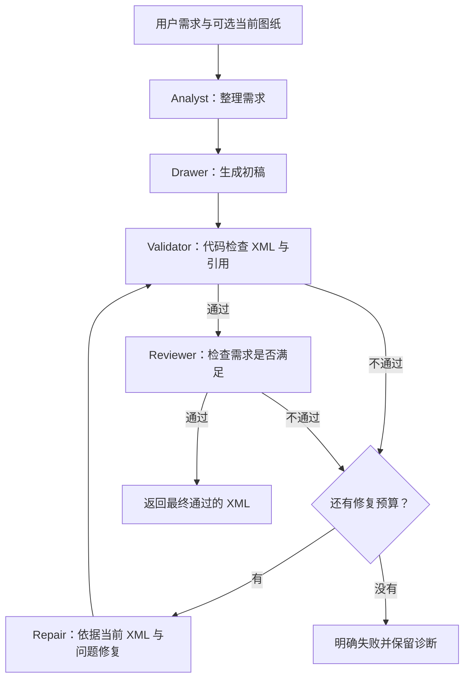

# AI Agent 绘图项目 15 天改造与面试学习计划

> 创建日期：2026-09-08  
> 项目：`D:\Projects\GolandProjects\ai-agent-scaffold`  
> 学习材料：`C:\Users\YHJ\Downloads\AI-Engineer-from-scrach-main`  
> 当前版本：15 天冲刺版；取代原七周排期，保留原步骤编号便于查阅。  
> 主线：Reviewer Repair Loop → 工作流事件级 SSE → Eval → 面试演示；Memory 移至本轮之后。  
> 用途：作为后续逐步编码、讲解、验证和面试准备的共同执行依据。

## 0. 当前进度与下次入口

| 项目 | 当前状态 |
|---|---|
| 本次交付 | Day 5 / S05 前半：新增配置驱动 `drawio-repair` 工作流、四角色生产适配器、Factory/Runner/同步 HTTP 接入、结构化失败响应和完整学习文档 |
| 现状核对 | Day 4 Controller 已进入原 YAML → Armory → Factory → Runner → ChatService → HTTP 链路；通用 `runSequential` 与旧 `sequential_draw_process` 继续保留，baseline 显式锁定旧入口 |
| 代码实施 | Loader 启动期校验四角色与 `max-repairs`；Factory 按名称绑定现有 Agent 并检查 Reviewer/Repairer 协议；成功只返回 `state.final_xml`，失败返回业务码 `0005` 与 code/stage |
| 用户学习进度 | S00、S02、S03、S04、S05 学习文档与练习已提供，均待用户复述 |
| 最新验证 | 2026-09-10 配置、完整同步 HTTP 成功/失败链路、错误映射和 baseline 回归测试通过；一次修复成功离线证据为 5 次模型调用，持续坏修复为 4 次且 Reviewer 为 0；`go test -count=1 ./...` 与 `go vet ./...` 全量通过 |
| 当前进度 | Day 5 完成；S05 的生产配置与同步入口集成完成，HTTP Context 贯穿、整次超时、主动取消和真实图纸验证留到 Day 6 收尾 |
| 下一次行动 | 进入 Day 6 / S05 收尾：让请求 Context 从 HTTP 贯穿 Service、Runner、插件、Agent、模型与工具，增加整次工作流超时并验证取消后不再启动 Repair |
| 交付周期 | 2026-09-08（Day 1）至 2026-09-22（Day 15），连续 15 个自然日 |
| 学习安排 | 默认用户每天预留约 1–2 小时听讲、操作和复述；这是安排参考，不要求用户等待或亲自完成全部编码 |
| 本轮不实施 | S12—S14 Memory 功能，保留为后续候选，不占用这 15 天 |

**后续助手每次开始工作时先读本节、第 2 节、第 10 节日程和第 12 节。以当天任务包为执行单位，完成后更新进度与交接记录。已经完成的内容不重复讲读；能够提前完成就继续已授权的当天任务，不为凑天数等待。**

## 1. 目标：做出可以运行、验证、解释的项目

项目定位：基于 Go 后端与 React/Next.js 前端，通过多个角色协作生成和修改 Draw.io 图纸，并通过质量检查、有限次数修复、实时进度和真实评测提高可靠性。

完成必做主线后，应当能够展示：

1. 一个正常请求如何从需求分析走到合格图纸。
2. 一份错误图纸如何被检查出问题、反馈给 Repair、重新验证。
3. 修复仍失败、模型调用失败、用户取消时如何结束，为什么不会无限运行。
4. 前端如何实时展示实际执行阶段，如何只把最终通过的图纸加载到画布。
5. 改造前后质量、延迟和调用成本如何变化，数据从哪里来。
6. 自己能够指着关键代码解释状态、数据流、失败分支和设计取舍。

这里的“掌握”不要求手写整个框架，但至少能做到：说清输入输出、指出关键判断、解释一种替代方案、调整一个小规则并用测试验证。

### 1.1 范围与优先级

| 优先级 | 交付 | 完成依据 |
|---|---|---|
| 必做 0 | 当前链路讲解与基线留存 | 请求链路可解释；原始版本、案例、输出有记录 |
| 必做 1 | Validator + 结构化 Reviewer + Repair Loop | 通过、修复成功、耗尽预算、调用失败等路径可验证 |
| 必做 2 | 工作流事件级 SSE + 前端进度 | 执行未结束时就有真实阶段事件；断开可取消；最终结果不会重复或串到别的会话 |
| 必做 3 | 最小 Eval 与失败复盘 | 可以批量运行、保留逐条结果、按统一口径比较不同版本 |
| 必做 4 | 演示与面试材料 | 能复现演示；能讲出设计、证据和局限 |
| 本轮之后 | 会话持久化与短期 Memory | 不属于 15 天交付；主线完成后再单独安排 |

本轮不主动扩展 RAG、向量库、语音、Kubernetes、通用多 Agent 平台、复杂模型路由或独立 Tracing 平台。现有 MCP 和工具调用保留为基础能力，只有阻塞当前步骤时才处理相关问题。

这 15 天集中完成三项核心能力和面试准备。Memory、界面美化、评测扩展到 100 条、通用框架重构均不进入本轮；保留关键测试、失败处理、真实评测与讲解。不能用“接入了更多组件”代替主线完成。

## 2. 协作与教学方式

### 2.1 按当天任务包推进，编码和理解同步完成

S00—S16 是内容编号，不是需要各占一天的课程。按第 10 节将相关步骤合并成当天任务包；默认完成当天的实现、验证和讲解，避免把“阅读、计划、编码、讲解”分别拖成多天。

用户参与的学习时间建议分配为：10–15 分钟讲问题和方案，30–60 分钟结合运行结果讲代码，15–30 分钟复述和小练习。编码、调试和真实模型执行另按实际情况推进；学习计时不作为自动中止工具工作的限制。

固定顺序：

1. **提出具体问题。** 例如：“Reviewer 说通过了，为什么图纸还是打不开？”
2. **定位现有代码。** 先说明今天的调用链和行为，再说明准备改哪里。
3. **说明最小方案。** 给出输入、输出、核心分支、收益、代价和暂未覆盖的边界。
4. **实施当天任务包。** 相关步骤可连贯完成，保持已有功能可用；需要跨层修改时说明原因。
5. **验证真实行为。** 至少覆盖关键成功路径和关键失败路径；根据改动范围选择测试。
6. **讲解改动。** 沿一次实际执行解释数据怎么变，并按文件和逻辑代码块解释新增、修改、删除及其原因；简单语法可以合并讲，关键分支、状态变化和错误处理不能跳过。
7. **用户复述或小练习。** 例如修改修复上限，先预测结果，再运行验证。
8. **更新计划记录。** 分开记录代码状态、验证状态、理解状态和下一步。

用户要求继续当前已授权步骤时直接推进，不反复索要实现细节确认。用户说“先解释”“先不写代码”时只讲解。用户未回答理解题时标记“待复述”，不能替用户认定已掌握；用户希望继续时可带着这个待补点前进。

### 2.2 每次结束应交付的内容

- 这一步解决了什么具体问题，前后行为有什么差别。
- 一份当天独立的详细学习文档，覆盖所有新增、修改和删除的文件与逻辑代码块。
- 关键改动文件、入口函数和可点击行号；真实路径以最终格式化后的代码为准。
- 验证命令、结果、测试用例与代码分支的对应关系，以及尚未验证的部分。
- 两到三个值得理解的问题，以及一个可实际修改和验证的小练习。
- 一段基于本次实际实现的面试表述，不能只罗列技术名词。
- 更新后的当前步骤和下一次起点。

禁止把没有真实运行的场景写成“验证通过”，把模拟测试数据写成质量提升数据，或越过当天授权范围扩展功能。不要等用户答完每道理解题才继续已授权的实现；待补点集中在当天复盘及 Day 14—15 处理。

### 2.3 每日学习文档的强制详细标准

从本规则生效后，每个有代码改动的冲刺日都必须在 `docs/learning` 下生成或更新一份独立 Markdown 学习文档。文档目标是让用户离开聊天记录后，仍能顺着文档理解本日功能怎样进入整个项目。只列文件名、概念定义或最终结果不算完成。

每份文档必须包含以下内容：

1. **本日问题与原行为。** 用一个具体输入或失败场景说明原代码如何运行、问题在哪里、为什么值得改。
2. **目标行为与整体数据流。** 给出改造后的调用顺序，说明输入、输出、状态和失败出口；跨层改动必须从配置或 HTTP 入口讲到最终领域逻辑。
3. **改动总表。** 逐文件列出“新增 / 修改 / 删除”、对应符号或配置项、改动前职责、改动后职责和改动原因。
4. **逐文件、逐逻辑代码块讲解。** 每个新增或实质修改的类型、接口、函数、核心分支、配置块和测试块都要单独说明：
   - 它在项目调用链中的位置；
   - 接收什么输入、产生什么输出、读写什么状态；
   - 代码按什么顺序执行，每个关键判断在防止什么问题；
   - 为什么放在这一层，为什么采用当前实现；
   - 它和前后代码、配置、错误类型、测试的关系；
   - 当前取舍、边界和后续步骤会怎样使用它。
5. **修改代码的 Before / After。** 对行为发生变化的关键代码给出精简的改前/改后片段或伪代码，指出具体改了什么、为什么不能继续保持原写法、兼容性有什么变化。不能只贴 After。
6. **删除代码说明。** 每一处实质删除都要记录被删内容原来做什么、为什么不再需要或为什么有问题、由什么替代、删除后是否影响调用方。当天没有实质删除时也要明确写“本日无实质删除”，避免遗漏。
7. **一次完整运行示例。** 选一个代表性输入，按真实函数顺序解释数据在每层怎样变化；同时至少讲一条失败路径。
8. **测试与证据。** 把每个关键规则对应到测试用例，记录实际执行的命令和结果；模拟、离线、真实模型、浏览器验证必须分开标注。
9. **限制、排错与面试表达。** 说明当前没有覆盖什么、常见故障从哪里查、如何用 30 秒和 2 分钟讲清本次设计。
10. **术语、理解题和小练习。** 解释当天新术语，给出问题以及可修改一处代码后运行验证的练习，但不能替用户标记“已掌握”。

“逐逻辑代码块讲解”不等于机械翻译每一行语法。连续的字段赋值、普通循环等可以合并说明；凡是决定控制流、状态、数据契约、错误分类、并发、重试次数、兼容性和安全边界的代码必须详细解释。文档可以引用短代码片段，但不能整文件复制源码来代替讲解。

文档中的文件链接与行号应在代码格式化和最终测试后核对。代码继续变化导致行号失效时，后续修改该模块的当天要同步修正文档。

### 2.4 新增和修改代码的注释标准

后续新增或实质修改的业务代码必须带有适量中文注释，注释重点解释职责、约束和“为什么这样做”。至少覆盖：

- 新增的核心类型、接口、配置字段和入口函数负责什么；
- 不容易看懂的算法步骤、两阶段处理、状态机和关键不变量；
- 失败分支为什么停止、重试或转换错误；
- 修复次数、超时、序号等容易混淆的数值含义；
- 并发、Channel、Context、取消和资源释放的原因；
- 为兼容原流程、基线或外部接口而保留的特殊处理；
- 关键测试在模拟什么场景、希望防止哪一种回归。

注释不能只是把代码翻译成中文，例如“给变量赋值”或“遍历数组”。明显代码不强行逐行注释，避免噪声遮住真正重要的逻辑。注释必须跟随实现更新；代码被删除时，相关过期注释一起删除，而删除原因写进当天学习文档和台账。

### 2.5 当天完成门槛

一天的功能只有同时满足以下条件，台账才可以把“代码/交付状态”标为“已完成”：

- 功能代码已经完成，关键成功和失败路径经过适当测试；
- 已对照本日改动清单，确认新增、修改和删除没有漏写；
- 关键新代码已经按第 2.4 节检查注释，注释与实际行为一致；
- 详细学习文档满足第 2.3 节，能从原行为讲到新行为，并覆盖每个逻辑代码块；
- 文档中的命令、验证结论、文件链接和行号已经核对；
- 代码状态、验证状态和理解状态分别记录，用户未复述时仍标记“待复述”。

## 3. 原项目事实基线与需要补齐的能力

本节以 evals/baselines/day01-original-20260908/source 保存的 75 个原应用文件为原项目基准，并与 Day 2 当前工作区分开。.env 没有进入快照或 Git；本次只检查变量是否配置及读取路径，没有记录或输出密钥。用户确认该项目以前使用现有中转站配置能够正常运行。2026-09-08 的 404、EOF、429 或 MCP 不可达只代表当次凭据、上游和网络状态，不能反推原项目设计不可运行。

### 3.1 原项目到底是什么

原项目不是只有接口和目录的空 Scaffold。它是一个配置驱动的 Go + Next.js Draw.io Agent 应用：后端能够从 YAML 装配两个 Agent 应用，通过 OpenAI-compatible 中转站调用模型，执行单 Agent 或多角色工作流，处理模型工具调用，并提供同步聊天与流式接口；前端能够创建本地聊天、发送请求、保存消息和图纸、向 Draw.io 加载 XML，并可显式把当前画布 XML 附到下一次请求中。

绘图应用的真实对外入口是 sequential_draw_process：

    用户当前消息
      → agent_analyst：输出 analysis_result
      → agent_drawer：读取 analysis_result，输出 draft_diagram XML
      → agent_reviewer：读取 draft_diagram，检查并直接修正，输出 final_result XML
      → Runner 返回最后一个子 Agent 的字符串
      → 前端识别为 XML 后保存到 localStorage 并加载到 Draw.io

因此必须准确表述：**原 agent_reviewer 的设计输出就是完整裸 XML，而且它已经承担“一次检查 + 直接修正”的职责。** Day 2 Validator 的理由不是 Reviewer 被设计成返回普通文本，而是运行时只把实际响应保存为一个 string，在交付前没有 XML Parser 和确定性结构检查。后续 Repair Loop 也不是第一次给项目加入“修图”，而是把原先藏在一次 Reviewer 调用里的判断与修改拆成程序可控制、可记录、可限次的审查和修复阶段。

### 3.2 分层与运行事实

| 范围 | 原项目实际行为 | 对后续计划的影响 |
|---|---|---|
| 环境与配置 | cmd/server/main.go 默认读取 .env；已存在的进程环境变量优先；Agent Loader 再展开环境变量占位符。当前 OPENAI_BASE_URL、OPENAI_API_KEY 与百度 MCP 变量都有非空配置 | 保留用户现有中转站方案，不因某次过期密钥或上游错误改写架构；真实验证时单独记录时间、模型和错误 |
| Agent 应用 | YAML 配置 100003 单 Agent 和 300000 Draw.io 三角色应用；绘图 Runner 选择顺序工作流 | 回归时同时保护普通 Agent 和绘图 Agent，不能只测新闭环 |
| Reviewer | 原 Reviewer 读取 draft_diagram，检查 XML、引用和布局，发现问题直接修正，最后返回裸 XML | S03 将“判断”改成结构化 Reviewer，将“修改”交给 Repair；完整闭环仍向现有前端返回 XML |
| 装配链 | Bootstrap 建立 Root → AiAPI → ChatModel/Tools → Agents → Workflows → Runner → Registry；每个应用最终按 agentId 注册 | 继续沿用现有 Factory/Armory，不重写整套装配框架 |
| 框架命名 | 核心 Agent、Workflow、Runner 和 OpenAI-compatible 客户端是项目自己的实现；EinoProvider 是本地类型名，并未引入 CloudWeGo Eino；Google ADK 当前只用于创建 logging plugin 对象，适配器没有执行其真实 callback | 面试时按实际代码说“自定义端口与运行时 + 部分 ADK plugin 适配”，不把命名扩大成完整框架能力 |
| Workflow | 顺序工作流通过 output-key 注入上一步结果；配置中的 loop 与 parallel 都由一次 for 循环顺序执行并聚合；MaxIterations 被加载但运行时不使用；对外 Runner 只选择顺序流程 | 配置里写了 loop 不等于已经存在 Repair Loop，写了 parallel 也不等于并发执行 |
| 模型调用 | 自定义客户端发 OpenAI-compatible Chat Completions；支持同步文本/工具调用和模型 token 流；单 Agent 的模型→工具→模型最多 4 轮 | 保留已有工具循环；把它与质量修复次数分开；S09 再补 usage |
| MCP | SSE 客户端已实现 initialize、tools/list、tools/call；两份 YAML 均配置百度 MCP 和本地 everything-test | MCP 是已有能力，不纳入本轮重做；只修阻塞主线的问题 |
| MCP 降级缺口 | 启动期 tools/list 失败会保留服务名占位工具并继续装配；错误存入 listFailures 但没有日志/API 暴露。本地 everything-test 依赖 127.0.0.1:3001 | “服务能启动”和“该工具真能调用”必须分开验证；以后排 MCP 时先暴露发现失败原因 |
| 工具 Schema | tools/list 当前只保留工具名，丢弃服务端 description/inputSchema；发给模型的所有工具统一成可选 query: string | 复杂 MCP 工具可能收到错误参数；这是 MCP 精度缺口，不是 Repair Loop 的前置任务 |
| Skill | SkillFactory 能扫描 configs/agent/skills 下的 SKILL.md 并把 SkillTool 暴露给模型，但当前执行仍统一进入 MCPToolRouter，SkillTool 没有对应执行器 | 当前 Skill 属于“可发现、不可真正调用”的半接入状态，面试不能说成完整 Skills Runtime |
| Session | Registry 和 SessionStore 都是进程内 map；CreateSession 按 userId + agentId 复用 ID；调用方传入非空 sessionId 时没有校验归属；模型消息每次只组装 system + 当前 user | sessionId 目前是路由/ bookkeeping 标识，不是对话 Memory；S12 以后再修会话语义 |
| MySQL/Redis | 有配置结构、连接适配器和 Docker Compose，但 bootstrap.Build 没有调用 OpenMySQL 或 OpenRedis | 当前主链路不要求启动 MySQL/Redis；S13 所说“使用现有技术栈”是正式接入已有适配器，不是复用现成持久化业务 |
| HTTP | 已有列表、创建会话、/chat、/chat_stream；同步业务错误仍包装为 HTTP 200 Envelope | Day 2 使用业务码承载校验错误；后续 SSE 要明确流开始前与流内错误 |
| Streaming | 单个 LLM Agent 可以转发模型 token；Workflow 的 stream 会先同步跑完整流程，再只发送最终字符串 | 项目已有“流式接口和单模型 token 流”，缺的是绘图工作流阶段事件和前端消费，不应描述成完全没有 Streaming |
| Context/取消 | 模型与 MCP 端口接收 context.Context，但 Runner 和 plugin 调用使用 context.Background()，HTTP 请求取消没有贯穿进去 | S05 要改的是整条请求生命周期传递，不能只在最底层加超时 |
| 前端 | 真实调用同步 /chat；浏览器 localStorage 保存消息、backendSessionId 和 drawIoXml；开启“使用画布上下文”时先导出 XML，再显式拼入本次消息 | 这是一种已经存在的显式图纸上下文，但不是后端自动 Memory；S08 在此基础上接事件流 |
| 前端 XML/错误 | 原前端用 mxfile/mxGraphModel 字符串特征判断结果；业务失败只显示 info，当前还不消费 Day 2 返回的结构化 issues | Validator 才是结构门禁；后续前端错误展示可使用 issues，但不把它提前扩成 Day 3 范围 |
| 测试与质量 | 原始运行时已有 output-key 注入和工具循环测试；Day 2 已增加 Validator/Runner/HTTP/配置测试。前端当前 lint 有 4 个错误和 2 个警告 | 后端继续复用测试替身；前端改造日先记录并处理相关 lint 基线，再做构建和浏览器验证 |
| Git 与基线 | 当前目录已有 .git，main 与 origin/main 指向同一初始提交；Day 2 文件仍是未提交工作区改动。Day 1 的 75 文件快照才是本计划约定的原应用行为基线 | 后续对比以快照和 eval mode 为准；不能把当前 Git 初始提交误称为纯粹的改造前应用，因为其中已经包含部分 Day 1 产物 |

### 3.3 已有、半接入与本轮新增

- **原项目已有：** 中转站配置、OpenAI-compatible 模型调用、三角色顺序绘图、Reviewer 一次性检查并修图、output-key 传值、最多四轮工具调用、MCP SSE 协议客户端、同步 HTTP、单 Agent token 流、前端本地会话/图纸保存和显式画布上下文。
- **已有骨架但语义不完整：** loop/parallel、工作流 streaming、后端 session、MCP 发现诊断、MCP 参数 Schema、Skill 执行、ADK logging plugin、MySQL/Redis 接入。
- **Day 2 已新增：** Reviewer 最终 XML 后的确定性 Validator、结构化校验问题和 HTTP 错误映射。
- **本轮接下来新增：** 结构化 Reviewer、独立 Repair、有限状态循环、请求取消、工作流事件级 SSE、前端进度、usage/运行指标和 Eval。

后续每日开始前以本节和 docs/learning/S00-现有请求链路.md 为准。若实现发生变化，当天必须同步更新事实，不能继续沿用旧印象。
## 4. 学习材料如何对应到改造

把课程当成按需查阅的教材。每步只读相关章节，再把思想落实到现有 Go 项目，不照搬 Python 项目或更换框架。

| 编号 | 已核对的本地材料 | 本项目需要理解的内容 | 使用阶段 |
|---|---|---|---|
| K1 | [Multi-Agent 课程索引](C:/Users/YHJ/Downloads/AI-Engineer-from-scrach-main/04-multiagent/multi-agent-arch/README.md)、[分层架构完整 Notebook](C:/Users/YHJ/Downloads/AI-Engineer-from-scrach-main/04-multiagent/multi-agent-arch/02_hierarchical_multi_agent_demo.full.ipynb) | 角色分工、Verifier、质量检查与路由 | S00、S03、S04 |
| K2 | [工具参数校验示例](C:/Users/YHJ/Downloads/AI-Engineer-from-scrach-main/05-model-route/08/guard/schema.py) | 把契约写成代码；模型返回不满足契约时如何处理 | S02、S03 |
| K3 | [waku 的 Agent Loop](C:/Users/YHJ/Downloads/AI-Engineer-from-scrach-main/12-hermes-agent-small/waku/loop/agent.py)、[Pi Agent Loop](C:/Users/YHJ/Downloads/AI-Engineer-from-scrach-main/13-pi-agent/02-agent-loop.md) | 观察反馈、循环状态、预算与停止条件；区分工具循环和质量修复循环 | S04、S05 |
| K4 | [Pi Events](C:/Users/YHJ/Downloads/AI-Engineer-from-scrach-main/13-pi-agent/03-events.md) | 运行时发事件、上层消费事件、前端更新状态 | S06—S08 |
| K5 | [Eval 不变量](C:/Users/YHJ/Downloads/AI-Engineer-from-scrach-main/08-hermes-agent/03-eval/notes/01_eval_invariants.md)、[最小 Eval Harness](C:/Users/YHJ/Downloads/AI-Engineer-from-scrach-main/08-hermes-agent/03-eval/notes/03_eval_harness.md) | 行为契约、冻结输入、离线重放、失败根因分析 | S01、S02、S04、S10、S11 |
| K6 | [waku 确定性评测](C:/Users/YHJ/Downloads/AI-Engineer-from-scrach-main/12-hermes-agent-small/evals/deterministic/README.md)、[LLM Judge](C:/Users/YHJ/Downloads/AI-Engineer-from-scrach-main/12-hermes-agent-small/evals/judge/README.md) | 规则检查与语义打分分开；Judge 也可能出错 | S10、S11 |
| K7 | [Hermes Memory 学习入口](C:/Users/YHJ/Downloads/AI-Engineer-from-scrach-main/08-hermes-agent/01-memory/README.md)、[waku 架构](C:/Users/YHJ/Downloads/AI-Engineer-from-scrach-main/12-hermes-agent-small/docs/architecture.md)、[Retrieval Gate](C:/Users/YHJ/Downloads/AI-Engineer-from-scrach-main/12-hermes-agent-small/waku/memory/retrieval_gate.py) | 持久化、工作上下文、长期记忆与按需检索的区别 | S12—S14 |

材料索引可能有失效链接。例如当前本地没有索引中列出的 `02.5_verifier_quality_gate.ipynb`，实际阅读时应查找完整 Notebook 中对应内容，不能假定拆分文件存在。材料路径变化时先定位新路径并更新本节。

## 5. 目标工作流与设计约定

### 5.1 最终目标流程



模型/工具调用错误、审查协议错误、超时、取消是另外的退出路径，不等同于“图纸质量不合格”。Repair 每次完成后都回到 Validator，不能只再问一次 Reviewer。

### 5.2 各角色的边界

| 组件 | 输入 | 输出 | 责任 |
|---|---|---|---|
| Analyst | 原始用户需求、可选当前图纸 | 需求说明 | 保留用户硬约束；补全的假设与明确要求区分 |
| Drawer | 原始需求、分析结果 | 初稿 XML | 生成图纸 |
| Validator | 当前候选 XML | 结构化检查结果 | 检查可确定的语法、结构、引用关系 |
| Reviewer | 原始需求、分析结果、当前候选 XML | 结构化审查结果 | 检查遗漏节点、错误关系、用户要求是否被满足 |
| Repair | 原始需求、分析结果、当前候选 XML、本轮问题 | 修复后的完整 XML | 针对问题修改，并尽量保留正确内容 |
| Workflow 控制器 | 配置、运行状态、各阶段结果 | 成功结果或明确失败 | 控制顺序、预算、状态更新和退出 |

Validator 是普通 Go 代码，不需要包装成一个调用模型的 Agent。结构合法并不证明图纸正确或美观。Reviewer 只读 XML 时，也不能宣称已验证所有视觉重叠和交叉；这类问题需实际渲染或后续几何检查支持。

### 5.3 审查协议与失败分类

Day 3 / S03 已固定的审查结果协议：

```json
{
  "passed": false,
  "issues": [
    {
      "type": "missing_edge",
      "description": "需求要求下单成功后触发库存扣减，图中缺少对应关系",
      "element_ids": ["order_service", "inventory_service"]
    }
  ]
}
```

规则：

- Validator 的 `dangling_reference` 表示引用了不存在的对象；Reviewer 的 `missing_edge` 表示漏了需求中的关系，两者分开记录。
- `passed` 必须显式存在且为布尔值；`issues` 必须是符合约定的数组；第一版所有 issue 都是阻断问题，因此 `passed` 当且仅当 `issues` 为空。
- 每个 issue 必须显式包含非空 `type`、非空 `description` 和数组类型 `element_ids`；无法定位已有元素时使用空数组。`type` 第一版保持可扩展，不冻结枚举。
- 空回复、Markdown 包裹、未知字段、错误字段类型、截断 JSON、缺少必需字段、额外 JSON/文字、互相矛盾的结果，都不能默认为通过。
- 第一版采用提示词约束 + 严格解析 + 业务校验。是否使用供应商原生结构化输出，根据当时接口能力验证，不预设必需。
- 第一版审查协议错误直接返回 `review_protocol_error`，不悄悄追加模型调用；日后若增加协议重试，应独立计数和评测。
- 质量失败可以进入 Repair；网络、鉴权、工具或模型调用失败先明确报错，暂不叠加自动网络重试策略。

### 5.4 修复预算与状态

默认 `max_repairs = 2`；允许 `0` 用作对照实验，`3` 作为后续实验选项，负数或超出已定义范围的配置应在启动/装配时拒绝。

- 首次生成的 `attempt = 0`，第一次修复后 `attempt = 1`。
- `max_repairs = 2` 意味着最多调用 Repair 两次，最多检查三个候选版本。
- Analyst 和 Drawer 在一次运行内各执行一次，修复时不重复分析和从零绘制。
- 单个 Agent 内部已有“模型 → 工具 → 模型”循环预算；它与质量修复预算是两层机制，不能混为一谈。
- 建议显式使用“最大修复次数”的配置；若兼容已有 `max-iterations`，必须记录含义与转换，禁止静默改变旧配置语义。

运行状态至少包含：`run_id`、需求与分析结果、`current_xml`、`attempt`、最近校验/审查结果、修复次数、最终状态与失败原因。`final_xml` 只在通过全部检查后赋值。状态在每次请求内部创建，不能存在共享 Agent 的可变字段里。

失败或取消时保留上一次已经成功加载的画布；未通过的候选图可以保留为诊断产物，但不能标成成功结果。

### 5.5 接入方式

沿用现有 Go 分层、Factory 和 YAML 装配。确定性规则和状态放在领域层合适位置，模型调用通过端口，HTTP 层负责请求和传输。S04 先做可离线验证的控制器；S05 再以清晰的绘图工作流配置接入 Runner。

具体包名与接口在实施时依据代码确定。避免把整个 Repair Loop 写进 HTTP Handler，也不把任意顺序工作流的“最后一个字符串”直接作为最终结果。此次不重写整个 Agent 框架，不顺带实现通用并行调度器。

## 6. 必做实施步骤

### S00：讲清当前请求链路

- **目的：** 对已有代码建立共同理解，避免在不了解基础的情况下堆功能。
- **工作：** 以“画一个登录流程图”为例，串起前端发送、HTTP Handler、ChatService、Runner、三个 Agent 与画布加载；再单独解释启动时 YAML 如何装配成对象。
- **产物：** 已创建并在本次复核中扩写链路事实文档，覆盖启动、运行、Reviewer、MCP、Session、Streaming、前端与基础设施边界。
- **验收：** 用户能解释 `agentId`、`sessionId`、`output-key` 的区别；能找到真正发出模型请求的位置。
- **面试练习：** “一次用户请求经历了哪些步骤？配置驱动体现在哪里？”

### S01：保留基线与固定案例

- **目的：** 后续能回答“改造有没有改善”，并保留可回退依据。
- **工作：** 核对 Git 与原始版本。Day 1 已保存 75 个原应用文件的源码快照和哈希；当前目录已经有 Git，main 与 origin/main 指向同一初始提交，Day 2 改动仍在工作区。后续不擅自推送远程，敏感配置继续排除。
- **案例：** 先准备 10 条开发用 Prompt，覆盖简单流程、条件分支、架构图、中文特殊字符、较复杂引用；每条写出必需节点/关系与验收要点。
- **原始结果：** 保存原流程最终输出、错误、耗时以及能取得的初稿和模型信息，不先润色或手工修好。
- **验收：** 原版本可找到；同一输入可重跑；真实调用与模拟样例明确分开。如果模型环境暂不可用，保留基线版本并标记“真实结果待采集”，可以继续离线开发，但不能宣称已有 Before 数据。
- **面试练习：** “为什么先保留基线？固定 Prompt 是否就能保证输出完全可复现？”

### S02：实现确定性 XML Validator

- **目的：** 用代码检查明确规则，建立质量闭环的基础。
- **工作：** 先约定本项目接受的生成格式，再实现解析和检查；第一版以当前提示词要求的未压缩 `mxfile → diagram → mxGraphModel → root → mxCell` 为主。
- **检查范围：** 完整单份 XML、必需结构、非空且唯一的 ID、父级与边端点引用有效、节点基础 geometry 合理。ID 按每页图的作用域检查；多页、压缩图和对象包装等未支持格式应明确报“不支持”，不能静默略过再通过。
- **边界：** 采用 XML 解析器而不是正则/字符串包含；不把缺失的合法可选属性全部当错；能解析只是必要条件，不能冒充完整 Draw.io 兼容认证。
- **接入：** 先完成纯函数与结构化结果，再接到原 Reviewer 最终输出的返回边界，拦住无效结果；自动修复尚未实现时明确返回失败。
- **测试：** 合法样例、不闭合标签、空/多个文档、重复 ID、悬空引用、边引用顺序变化、无效几何参数和未支持格式。失败结果不得成为成功响应中的 XML。
- **验收：** 同一输入总是得到相同结果；输出有可用于定位的问题；不增加模型调用。
- **面试练习：** “为什么已经有 Reviewer 还需要 Validator？合法 XML 和正确图纸有什么区别？”

### S03：拆分 Reviewer 与 Repair 的协议

- **目的：** 把“哪里有问题”和“如何改图”分成可控制、可记录的步骤。
- **工作：** 在承认原 Reviewer 已经“一次检查并直接修图”的基础上，把它拆成两个清晰协议：Reviewer 只返回结构化审查结果，Repair 根据当前候选与问题返回完整 XML；Reviewer 输入必须包含原始需求，两个输出都做严格解析和错误分类。
- **迁移方式：** 先在独立测试/新工作流配置中验证，原线上入口仍返回 XML。到 S05 一次切换完整闭环，避免过渡状态把 Reviewer JSON 送进画布。
- **测试：** 通过、不通过、JSON 截断、字段缺失/类型错误、通过却带阻断问题；确认 Repair 收到的是本轮问题和当前版本，而不是过期初稿。
- **验收：** Reviewer 结果是程序能判断的对象；协议错误和质量不合格可以区分。
- **面试练习：** “提示词要求 JSON 是否足够？Reviewer 自己判断错了怎么办？”

### S04：实现有限次数 Repair Loop

- **目的：** 让程序根据检查结果决定继续或退出。
- **工作：** 按第 5 节实现请求级状态和有上限的控制流，先通过模型替身验证，不依赖真实 API。
- **核心规则：** Validator 不通过时跳过语义 Reviewer，带结构问题进入 Repair；Reviewer 不通过时带语义问题进入 Repair；修复后更新候选版本并从 Validator 重新检查。
- **必要用例：** 首次通过；一次修复成功；修复生成坏 XML；持续失败耗尽两次预算；零修复预算；Reviewer 协议错误；模型错误；取消；两次运行状态不串用。
- **调用关系断言：** 首次通过不能调用 Repair；上限耗尽不能再调用模型；Analyst/Drawer 不在修复循环中重复执行；最终交付的是通过审查的同一个候选版本。
- **验收：** 各失败原因可观察；不存在无限循环；不会把最后一份失败候选当成功交付。
- **面试练习：** “Repair 与简单 Retry 的区别是什么？为什么多试几次可能更慢、更贵甚至更差？”

### S05：接入真实绘图入口，打通取消与超时

- **目的：** 从离线控制流变成用户可用功能，并控制长请求的生命周期。
- **工作：** 接到 YAML/Factory/Runner；同步接口成功时兼容现有 `content` 返回方式。将请求 `context.Context` 从 HTTP → Service → Runner → Agent → 模型/工具传递下去，定义整次运行超时。
- **配置：** 明确必需角色与引用、修复预算，拒绝缺失角色、无效引用或含义冲突的配置；保留原流程作为对照模式。
- **测试：** 用本地假模型服务或测试替身验证 HTTP 成功/失败、断开取消、不再继续修复；回归普通单 Agent 和原有工具循环。
- **真实验证：** 小批量真实模型调用，记录成功和失败；检查至少一份图能在 Draw.io 中实际加载。若无法验证，明确保留待办。
- **验收：** 原入口可用；错误不伪装成图纸；取消能传到在途请求，返回后不启动后续阶段。
- **面试练习：** “为什么不能一直用 `context.Background()`？为什么每次模型调用超时还不够？”

### S06：定义并发出工作流事件

- **目的：** 让执行过程能被前端和诊断记录共同使用。
- **工作：** 设计最小事件类型，包含 `run_id`、会话标识、递增 `seq`、`type`、`stage`、`attempt`、时间和必要数据；通过简单回调/接口在阶段边界发送。
- **事件约定：** `workflow.started`；阶段的 `started/completed`；`validator.passed/rejected`；`reviewer.passed/rejected`；`repair.started/completed`；终态 `workflow.completed/failed/cancelled`。
- **语义：** `rejected` 表示检查执行成功但质量未通过；运行异常走 `workflow.failed`，避免把两种“失败”混在一起。
- **测试：** 事件发生在实际阶段边界；`seq` 在单次运行内递增；`attempt` 对应当前图；内部终态只产生一次；不同运行标识不混用。
- **验收：** 工作流不依赖浏览器；可以在测试中收集同一套事件。
- **面试练习：** “模型 Token 流和工作流事件流有什么区别？为什么事件由运行时产生？”

### S07：贯通 SSE 传输与解析

- **目的：** 执行尚未结束时，客户端就能接收已发生的事件。
- **工作：** 在 `/chat_stream` 发送真实事件、设置所需响应头并及时 Flush；用 POST + `fetch` 读取流；实现可单独验证的 SSE 解析，不用 `EventSource` 强行发送 POST JSON。
- **处理细节：** 网络 chunk 不是完整事件；支持跨 chunk 的 UTF-8、事件边界、CRLF、多个事件和多行 `data`；区分开始流之前的 JSON 错误与流内错误。
- **生命周期：** 前端 Abort/断开触发后端 Context 取消；使用有界缓冲和能响应取消的发送；长期无业务事件时可加心跳，心跳不冒充进度。
- **测试：** 人为挂起后续阶段时，第一条事件已收到；解析跨 chunk 事件；中途错误/EOF/取消后正确收尾；不发生生产者永远阻塞。
- **验收：** 不靠定时器模拟执行阶段；无终态直接 EOF 时不能显示成功。连接已经断开时不保证客户端收到 cancelled 事件，应由本地状态和服务器记录分别反映。
- **面试练习：** “HTTP chunk 为什么不能直接 JSON.parse？SSE 为什么可能被缓冲？用户关页面后怎么办？”

### S08：前端展示进度并更新画布

- **目的：** 用户能理解等待过程，知道图纸是否已经通过检查。
- **工作：** 把绘图发送接到事件接口，增加简洁阶段列表、修复轮次、错误提示与停止按钮；以 `run_id + sessionId` 关联事件。
- **画布规则：** 只有成功终态才加载最终 XML；中间候选不反复覆盖；失败/取消保留上一份成功图纸。
- **状态规则：** 切换会话后旧请求不得更新新会话；重复事件或重复终态不得重复加载；运行结束后按钮恢复；运行异常与质量耗尽给出可理解提示。
- **测试与演示：** 正常生成、一次修复、预算耗尽、主动取消、生成期间切换会话；按改动运行前端类型/构建检查并进行浏览器验证。
- **验收：** 页面显示的阶段来自事件；能解释“正在执行”和“已经完成”的区别。
- **面试练习：** “异步返回为什么会串会话？为何不让半份 XML 持续刷新画布？”

### S09：采集耗时、调用量与可用 Token usage

- **目的：** 让后续质量与成本结论有原始记录支持。
- **工作：** 扩展模型返回结果以携带供应商实际 usage；按模型调用、阶段和 run 记录耗时、调用数、工具调用数、修复次数、错误与 Token；复用事件和阶段结果写最小 JSONL 记录。
- **统计规则：** usage 缺失记为 `null/unknown`，不能写成零；只知道部分调用 usage 时标记不完整，报告已知值与覆盖率；流式/工具循环去重累计。
- **范围：** 工作流自身成本与外部评测 Judge 成本分开。记录显式问题和审查结果即可，不要求模型输出隐藏思维过程；API Key、鉴权头不写进日志。
- **测试：** 假响应的 usage 能传到汇总；缺失/部分 usage 不被误报为完整值；失败调用仍有次数和耗时记录。
- **验收：** 一次运行能追溯到阶段和调用；不能获得的字段有明确说明。
- **面试练习：** “平均 Token 是怎么算的？如果兼容接口不返回 usage，你如何诚实报告？”

### S10：实现最小批量 Eval

- **目的：** 用固定案例和统一规则比较原流程、无修复与有修复版本。
- **工作：** 增加可脚本执行的评测入口，读取案例、按明确模式运行、保留逐条结果，并生成 Markdown 报告；第一版顺序执行，默认每条独立会话/状态。
- **规模：** 先用已有 10 条开发案例打通，本轮总计约 50 条：10 条用于调试，约 40 条冻结为验收集；A/B/C 各跑一次完整验收集。100 条扩展和大规模重复实验放到本轮之后。
- **测试：** 用离线结果验证统计公式、错误计数、缺失 usage、分母和 P95；模拟测试只用于验证评测器，不当成真实模型成绩。
- **验收：** 一条结果能追溯到输入、模型、模板版本、候选 XML、审查结果和失败原因；失败案例不会被静默跳过。
- **面试练习：** “为什么要保留失败样本？如何区分流程重构的提升与 Repair 本身的提升？”

### S11：完成对比报告与失败复盘

- **目的：** 把运行结果变成可信的工程结论。
- **工作：** 按第 8 节完成真实对比；对结构错误、需求遗漏、审查误判、修复退化和调用异常分类，选有代表性的案例复盘。
- **人工复核：** 按统一规则抽查约 10 条，覆盖通过、拒绝和修复案例，检查 Reviewer 自评是否可信；抽样结果单独报告，不外推成全量人工正确率。
- **报告：** 说明质量变化、新增延迟和调用成本、未解决问题。没有提升时也保留结果，分析是否值得保留当前策略。
- **验收：** 每个写进报告的数字都有统计口径、样本数和原始结果；可以展示至少一个真实成功案例和一个真实失败/限制案例。
- **面试练习：** “通过率提高但延迟翻倍，你怎么取舍？你遇到过最有代表性的失败是什么？”

## 7. 本轮之后的 Memory 候选：先解决连续修改与会话边界

S12—S14 明确不纳入 15 天排期，保留设计供后续使用。即使主线提前完成，也先完善验证与面试复述，不自行插入 Memory。S08 所需的运行标识和前端跨会话隔离仍属于本轮，不依赖先建 Memory 存储。

### S12：明确会话创建与隔离

- 当前 `CreateSession` 按 user + agent 复用一个 ID，前端新建多条聊天不一定对应独立后端会话。先明确“新建”和“恢复”的语义，再设计存储。
- 服务端验证会话属于对应用户与 Agent；客户端提交 userId 本身不构成身份认证，不能把简单演示登录描述为生产鉴权。
- 验收：两条会话独立，恢复同一会话可继续；外部传入的不匹配会话被拒绝；同会话并发修改采用明确策略，第一版可限制同会话同时只运行一次。
- 面试练习：“有 sessionId 为什么还会串上下文？”

### S13：持久化 conversation、message、diagram_version

- 正式接入项目已经存在但当前未被 Bootstrap 使用的 MySQL/GORM 适配器，再做三类数据的最小结构和 Repository；记录用户/Agent 归属、顺序、版本关系、生成运行标识与状态。
- 一次成功图纸建立新版本；消息与图纸版本的一致性使用明确事务边界。失败候选不成为当前成功版本，诊断轨迹可单独保留。
- 验收：刷新和服务重启后可恢复；成功版本对应正确消息/run；重复完成通知不会创建重复版本；迁移和本地测试步骤可复现。
- 面试练习：“为什么图纸需要版本表？为什么不能只保存最后一份 XML？”

### S14：组装短期上下文

- 模型输入使用“当前需求 + 最近 N 轮有效对话 + 当前选定的图纸版本”，N 可配置，并设置总体上下文预算；避免当前需求和同一份 XML 重复注入。
- 超预算时先裁剪较旧对话；不要把 XML 任意截断为无效文本。保留当前需求与完整图纸仍超限时明确提示，后续再考虑专门摘要/结构压缩。
- 验收：连续完成“画系统 → 加缓存 → 调整连线”，正确保留指定版本的已有核心节点；不同会话互不影响；大上下文行为可解释。
- 面试练习：“聊天历史、工作记忆、长期记忆有什么区别？为什么把全部历史塞进去可能更差？”

以下概念留作后续学习，15 天内仅在相关面试追问时简要说明：Semantic Memory（较稳定事实/偏好）、Episodic Memory（发生过的事件）、Procedural Memory（做事规则/步骤）、Retrieval Gate（决定是否检索）。当前图纸版本通常属于任务工作上下文，不自动等同于语义长期记忆。

## 8. Eval 设计与数据口径

### 8.1 三组对照，回答不同问题

| 模式 | 定义 | 能回答什么 |
|---|---|---|
| A：original | 保存的原始 Analyst → Drawer → Reviewer 直接改写 XML 流程 | 整体改造前后有什么差异 |
| B：review_only | 新 Validator + 结构化 Reviewer，`max_repairs=0` | 新审查架构在不修复时的表现 |
| C：repair_loop | 与 B 相同模型、模板、检查规则，`max_repairs=2` | 增加 Repair 带来多少收益与额外开销 |

原 Reviewer 已经可能修改图纸，因此 A 不能被描述为“完全没有修正”。A 没有结构化 Reviewer 通过率，该字段标 N/A，不从一句自然语言或最终 XML 猜测。

对比最终质量时，A/B/C 的候选结果都用同一份外部验收规则评估。控制流内部 Reviewer 的 `passed` 是运行指标，不等同于外部客观正确率。外部验收可结合确定性检查、固定 rubric 的独立评估调用与人工抽查；仅更换一个 Judge 名称不能消除偏差。

更严格地隔离 Repair 收益时，可以让 B/C 复用冻结的同一初稿和初次审查结果，再从同一位置分别停止/修复；这组属于离线配对实验，不能混作完整请求的端到端延迟。

### 8.2 指标定义

| 指标 | 统计口径 |
|---|---|
| 初稿可用结构率 | 初稿通过当前 Validator 的运行数 / 全部评测运行数；生成失败计未通过，并单列失败类型 |
| 一次审查通过率 | 在 attempt=0 同时通过 Validator 和 Reviewer 的运行数 / 全部运行数；仅 B/C 适用，未进入 Reviewer 的运行不能从分母剔除 |
| 最终工作流通过率 | 正常产生通过结果的运行数 / 全部运行数；调用错误、超时、预算耗尽不当成功 |
| 外部验收通过率 | 按同一外部规则接受的最终候选数 / 全部运行数；无候选计未通过；可以另报“已生成候选的条件通过率”，但不能混用 |
| 最终 XML 语法/结构率 | 分开报告 XML 可解析率和项目结构契约通过率；无输出或不支持格式不计通过，并列明类别 |
| 平均修复次数 | Repair 调用次数总和 / 全部运行数；零修复和失败运行都计入，另报耗尽预算比例 |
| 平均耗时、P50/P95 | 从运行开始到终态的墙钟耗时；报告全体终态和成功子集，标明样本数及分位数算法；小样本 P95 仅作观察 |
| 模型/工具调用次数 | 汇总每次实际调用，不把一次修复当成一次模型调用的必然等价物 |
| Token usage | 汇总供应商实际返回值；完整 usage 的平均值单列并附覆盖率；部分/缺失值不补零 |
| 失败分类 | 生成/工具调用错误、XML 语法/结构失败、语义审查不通过、审查协议错误、预算耗尽、超时、取消等 |

人工取消实验单列，不混入标准非交互验收集。中断的批量运行应记录未执行案例，报告“计划数/已执行数/未执行数”，不能把未执行样本伪装成完整数据集结果。

### 8.3 控制变量与结果保留

- 固定 Prompt、验收规则、模板版本、模型标识、可配置的采样参数、超时与工具配置；记录供应商和运行日期。相同参数不能保证远端模型输出完全确定。
- 主对比优先使用不依赖实时搜索的案例；需要工具的案例冻结工具返回或单独分组，避免外部搜索变化掩盖修复效果。
- 冻结验收集后，不根据其中失败结果反复调 Prompt 再把同一批成绩称为未见数据成绩；若用于调参，标记为开发集并补新验收集。
- 有预算时对代表性案例重复运行，报告样本数和波动；否则明确是单次样本观察，不声称统计显著提升。
- 逐条记录 `case_id`、模式、配置/模板版本、run、原始需求、候选版本、检查问题、修复次数、耗时、调用量、usage 可用性和最终状态。
- 模拟样例、真实运行、人工评分分别标记；不填写任何预设提升百分比。

## 9. 收尾：从实现转为面试表达

### S15：整理运行说明与演示材料

- 补齐启动方式、必要配置、离线测试、真实调用与评测运行方法；说明已有 MCP 依赖及可用的离线验证路径。
- 准备正常生成、修复成功、达到上限/取消三条演示路径。为演示流程稳定性可以保留模拟模式，但必须明确标注模拟，另保留真实模型运行证据。
- 准备一张系统结构图、一张修复状态图、一份真实评测表和若干脱敏运行记录。
- 若本地运行依赖尚未实际验证，不能在说明里标“开箱即用”。

### S16：面试复述与追问练习

形成三种长度的表述：30 秒项目介绍、2 分钟核心设计、5 分钟案例与取舍。统一使用“问题 → 方案 → 关键实现 → 验证结果 → 局限”。

至少能回答：

1. 为什么绘图任务采用多个明确角色？什么情况下一个模型调用可能更合适？
2. 为什么 Validator 和 Reviewer 要分开？为何 Reviewer 通过也不能保证完全正确？
3. Tool Loop、Workflow Repair Loop、网络 Retry 有什么区别？
4. 状态放在哪里？怎么知道 Repair 修改的是最新候选？
5. 哪些错误应该修图，哪些应该退出？最大修复次数为什么是实验参数？
6. SSE 如何边执行边展示？断开、缓冲、重复事件和跨会话怎么处理？
7. 改造效果如何证明？模型随机性、Judge 偏差和测试集调参怎么处理？
8. 如果最终通过率提升但成本明显增加，如何选择默认策略？
9. 若完成 Memory，如何保证会话与图纸版本一致？持久化与上下文有什么不同？
10. 哪些部分借鉴课程，哪些是针对当前项目设计和验证的？

面试表述只覆盖实际完成部分。可以坦诚说明借助 AI 编码，并说明自己如何约束需求、审阅设计、验证结果和排查失败。尚未掌握的模块写在待补清单，不通过背诵术语掩盖。

## 10. 15 天执行日程与完成标准

Day 1 已于 2026-09-08 开始，Day 15 为 2026-09-22；实际起止日期已写入第 0 节。日程是推进上限，不是等待安排；每次用户要求继续时，按台账接着完成当天任务。

| 天数 | 对应步骤与工作 | 当天交付/验收 | 当天必须能解释的内容 |
|---|---|---|---|
| Day 1 | S00 + S01：简要走通请求链路，保留原版本，准备 10 条开发案例并启动真实基线采集 | 能定位前端到模型的入口；原配置与结果可追溯；模型连通问题当天发现 | 一次请求怎么流转；为什么先留 Before |
| Day 2 | S02：实现 XML Validator 并接到原流程结果边界 | 合法图通过；标签、重复 ID、悬空引用等错误被拦住；关键测试通过 | Guardrail；结构合法与需求正确的区别 |
| Day 3 | S03：审查 JSON 协议、严格解析、独立 Repair 模板 | Reviewer 正常/异常回复能区分；原绘图入口不误收 JSON | Structured Output；检查与修改为什么分开 |
| Day 4 | S04：请求级状态与有限修复循环 | 模拟测试覆盖首次通过、修复成功、坏修复、上限、协议错误 | 状态如何更新；Repair 和 Retry 的区别 |
| Day 5 | S05：接入配置、Factory、Runner 和同步绘图入口 | 完整闭环可以从现有入口调用；返回的是实际通过的候选；记录最小调用次数与耗时 | 配置如何落到执行；为什么不能直接返回最后一个字符串 |
| Day 6 | S05 收尾：Context 传递、超时、取消、回归与真实图纸验证 | 后端闭环里程碑通过；取消后不再启动修复；实际 XML 可在画布加载 | 两层循环预算；请求生命周期与失败退出 |
| Day 7 | S06：事件结构与运行时阶段事件 | 事件顺序、run_id、attempt、唯一终态通过测试 | Token 流和工作流事件流的区别 |
| Day 8 | S07：SSE 发送与前端流解析 | 工作流未结束即可收到事件；跨 chunk、错误和取消处理可验证 | POST fetch 读流；为什么 chunk 不是事件 |
| Day 9 | S08：前端进度列表、修复轮次、终态画布更新和停止按钮 | 正常/修复/失败流程在页面可见；未通过候选不覆盖画布 | 前端状态怎样跟随事件；如何区分等待与完成 |
| Day 10 | S07—S08 联调收尾 + S09 接入指标 | SSE 前后端里程碑通过；跨会话、断开和重复终态处理正确；阶段记录可导出 | 事件关联、取消传播、如何定位卡住的阶段 |
| Day 11 | S09 + S10：usage 汇总、JSONL 记录、批量入口与统计；冻结约 40 条验收案例 | 10 条开发案例可批跑；离线统计测试通过；缺失 usage 明确标记 | Token 的来源；评测器如何保证统计口径 |
| Day 12 | S10：在冻结验收集运行 A/B/C 三组真实对照 | 保存逐条真实结果、错误和成本数据；完整记录已执行/未执行数量 | 如何控制变量；为什么需要 B/C 对比 |
| Day 13 | S11：报告、约 10 条人工抽查、失败根因分析与必要回归 | Eval 里程碑通过；得到真实对比表和代表性失败案例 | 通过率与正确率的区别；质量、延迟、成本的取舍 |
| Day 14 | S15 + S16：补齐运行说明、三条演示路径与面试讲稿 | 能完成 30 秒、2 分钟、5 分钟复述；关键表述有代码/测试/数据依据 | 用一个具体案例讲完整设计与证据 |
| Day 15 | 交付缓冲：修复阻断问题、最终回归、模拟面试和交接 | 必做完成清单逐项核对；证据、限制与待补点齐全；本轮收尾 | 针对追问解释设计取舍，而不是背术语 |

### 10.1 四个交付节点

- **Day 6：Repair Loop 能从实际入口运行。** 不能只留下独立函数或一张流程图。
- **Day 10：SSE 前后端贯通。** 不能只留下后端事件接口或模拟进度条。
- **Day 13：真实 Eval 报告形成。** 不能只有批量脚本而没有实际结果。
- **Day 15：功能、验证与面试表达共同收尾。** 不再把讲解和整理另排数周。

### 10.2 避免拖延的执行规则

1. Day 1 就检查模型与必要工具连通性。环境问题先隔离；能离线完成的 Validator、协议、循环测试继续推进，真实验证单独记为阻断，不以模拟数据替代。
2. 每天围绕明确交付推进。阅读课程限于当天相关知识，优先解释正在修改的代码；不安排先通读整仓或完整学习一套框架。
3. 不增加新基础设施和新的交付目标。单页未压缩 XML、有限修复、基本进度 UI、JSONL/Markdown 评测报告足以构成本轮第一版。
4. 发现进度落后时，先移除美化、额外抽象、扩展样例和非关键重构，用 Day 15 吸收必要联调；关键失败处理、测试和真实验收保留。
5. Day 12 的模型额度、供应商故障等外部阻断及时说明，完成不依赖它的文档、离线验证和讲解。不能静默延长计划，也不能把尚未完成的真实 Eval 标成已交付。
6. 日程变化必须在台账写明原因、受影响交付和补救方式；用户未要求延期时，优先调整实现范围与工作组合，不自行恢复长期排期。

必做主线完成标准：

- [ ] 有保留的原流程和可比较的基线。
- [ ] 正常成功、修复成功、预算耗尽、协议错误、调用错误、超时/取消均有证据。
- [ ] 前端实时展示真实阶段，只加载最终通过的候选，跨会话行为正确。
- [ ] 有逐条真实评测结果、明确指标口径和失败案例，没有虚构改善数据。
- [ ] 文档中的运行与测试方式已经按实际环境核对。
- [ ] 用户能完成一次完整项目复述，并回答主要设计取舍。

## 11. 文件组织与验证约定

本文件放在项目根目录，作为唯一的进度入口。后续学习笔记建议放在 `D:\Projects\GolandProjects\ai-agent-scaffold\docs\learning`，评测案例和结果建议放在 `D:\Projects\GolandProjects\ai-agent-scaffold\evals`。Day 1 已创建学习笔记和 evals 目录，后续沿用。

每次学习笔记采用 `Sxx-主题.md`。内容必须执行第 2.3 节的详细标准，以逐文件、逐逻辑代码块的解释为主体，并记录改动类型、Before / After、删除原因、运行示例、测试证据、限制、排错、面试问题和用户待补点；不能用复制整份源码代替讲解。

验证按改动范围进行：

- Go 行为变化先运行相关包测试，再进行必要的 `go test ./...`；并发/隔离变化在环境支持时加 race 检查，不把缺少 race 工具链写成通过。
- 前端改变时依据项目已有脚本进行 lint、类型/构建检查，并验证相关浏览器流程；基线已有问题单独记录，避免顺带扩大改造。
- XML 测试聚焦语法与引用关系，不要求模型输出与某份 XML 逐字相同。
- 工作流测试聚焦调用次数、状态迁移、候选版本与退出条件，不冻结提示词全文。
- 纯计划或说明文件改动只检查文件内容和链接，不为此反复跑全量业务测试。
- 真实模型调用、外部工具和成本记录均与离线测试分开；没有必要就不启动完整 MySQL/Redis/MCP 环境。

## 12. 执行台账与后续助手交接

状态用语：代码状态可为“未开始/进行中/已完成/后续计划”；验证状态为“未验证/部分验证/通过”；理解状态为“待讲解/待复述/已复述/需补充”。“代码已完成”不能自动把后两列改成通过。S12—S14 不计入这 15 天的完成分母。

| 步骤 | 代码/交付状态 | 验证状态 | 理解状态 |
|---|---|---|---|
| S00 现有请求链路 | 已完成 | 部分验证 | 待复述 |
| S01 基线与案例 | 已完成 | 部分验证 | 待复述 |
| S02 XML Validator | 已完成 | 通过 | 待复述 |
| S03 Reviewer/Repair 协议 | 已完成 | 通过 | 待复述 |
| S04 有限修复循环 | 已完成 | 通过 | 待复述 |
| S05 集成与取消/超时 | 进行中（Day 5 接入完成） | 部分验证 | 待复述 |
| S06 工作流事件 | 未开始 | 未验证 | 待讲解 |
| S07 SSE 传输 | 未开始 | 未验证 | 待讲解 |
| S08 前端进度 | 未开始 | 未验证 | 待讲解 |
| S09 运行指标 | 未开始 | 未验证 | 待讲解 |
| S10 批量评测 | 未开始 | 未验证 | 待讲解 |
| S11 报告与复盘 | 未开始 | 未验证 | 待讲解 |
| S12 会话隔离（本轮之后） | 后续计划 | 未验证 | 待讲解 |
| S13 持久化（本轮之后） | 后续计划 | 未验证 | 待讲解 |
| S14 短期上下文（本轮之后） | 后续计划 | 未验证 | 待讲解 |
| S15 演示与说明 | 未开始 | 未验证 | 待讲解 |
| S16 面试复述 | 未开始 | 未验证 | 待讲解 |

每次结束追加以下记录，并同步第 0 节的当前步骤：

```text
日期：
冲刺日：Day __（实际起止日期见第 0 节）
步骤：
当天目标及完成情况：
本次解决的问题：
实际修改/交付文件：
新增代码及逐块讲解覆盖情况：
修改代码的改前/改后与修改原因：
删除代码、删除原因及替代方案（无则明确写无）：
关键代码注释检查结果：
当天学习文档路径与详细标准检查结果：
已验证的行为、对应测试与命令结果：
尚未验证/当前限制：
用户已经复述的内容：
待讲解或待补练习：
设计调整及原因：
进度偏差、阻断与补救方式：
下一次从哪里继续：
```

### 2026-09-08：计划建立

- 本次交付：创建根目录计划文件，未修改业务代码。
- 依据：核对当前核心调用链与课程材料，记录已实现能力和缺口。
- 当前限制：还没有本计划的真实模型基线、评测数据或用户复述记录。
- 下一次：用户要求开始后执行 S00，先讲清现有请求链路；之后再进入基线留存和代码改造。

### 2026-09-08：调整为 15 天冲刺

- 用户要求：半个月完成本部分改造与学习，压缩原排期。
- 本次调整：替换七周安排为逐日交付；把相关步骤合并，编码、验证、讲解同日推进；Day 6/10/13/15 设置交付节点。
- 范围：Repair Loop、事件级 SSE、Eval 和面试准备必做；S12—S14 Memory 移至本轮之后。
- 实施状态：本次仅修改计划，功能开发尚未开始。
- 下一次：执行 Day 1 的 S00 + S01，简要讲链路后直接保留基线并准备案例，不将纯讲解单独排成一天。

### 2026-09-08：Day 1 / S00 + S01

- 实际周期：2026-09-08 至 2026-09-22（15 个自然日）。
- 本次交付：S00 链路讲解笔记；75 个应用文件的源码快照与 SHA-256 清单；10 条带验收要求的开发案例；独立 baseline 采集命令、记录器和测试；evals 运行说明。
- 原业务实现：未修改原 HTTP、Service、Agent/Runner、模型客户端、绘图 YAML 和 .env；工具禁用与模型覆盖仅属于采集器参数/内存配置。
- 验证：75 个副本哈希一致；10 条案例 ID 唯一且都有节点、关系与验收要求；go test ./... 通过（新采集器测试与原运行时测试）。
- 当时的自动采集观察：一次短探测返回 404 model_not_found，另一次绘图请求在 Analyst 阶段遇到 EOF，两个 MCP 地址当时 TCP 未连通。它们只说明那一时刻的凭据、网关、上游或网络状态，不说明原项目从未能运行，也不能据此判定生产模型配置错误；用户已确认项目此前可通过所配中转站运行。
- 采集条件：original-no-tools，复用原角色和 Runner，显式禁用工具；只尝试了第一条开发案例，另外 9 条未执行。无成功图纸、无通过率、usage 未知。
- 模型目录：当时保存了网关返回的可选名称，采集器覆盖模型只用于连通性探测，未修改生产 YAML。成功真实基线在凭据与上游可用时补采，不再把模型选择写成阻塞 Day 2/Day 3 的前提。
- 理解状态：已提供链路讲解、面试表述和三个练习；用户尚未复述，标记待复述。
- 运行限制：沙箱后续初始化/写文件异常，文档写入通过显式提权完成；没有因此改写业务行为。
- 下一次：模型选择确定后先补成功采集；用户要求 Day 2 时可先做离线 Validator，保留真实基线待补项，不等待所有外部服务齐备。

### 2026-09-08：Day 1 连通性补充与收尾

- 用户确认：项目在其正常启动方式下使用已配置中转站能够运行。
- 环境结论修正：此前 404、EOF、MCP TCP 未连通只描述 Codex 自动采集环境和当时请求，不能表述成项目整体无法运行。
- 进一步探测：采集器分别覆盖 deepseek-v4-pro、glm-5.3-flash；两者均被网关接受，但上游返回 429 限流。未修改生产 YAML，停止继续重试以免污染基线和加重限流。
- Day 1 状态：S00、S01 交付完成且部分验证；成功真实图纸基线保留为待补项，不阻塞 Day 2。
- 下一次：实现 Day 2 的确定性 XML Validator，并先用固定 XML 样例完成离线验证。
### 2026-09-08：Day 2 / S02

- 当天目标及完成情况：实现确定性 Draw.io XML Validator，并接到原 `agent_reviewer` 最终输出与 Runner 成功返回之间；目标完成。
- 本次解决的问题：原 Reviewer 的设计确实是检查、直接修正并返回完整 XML；但 Runner 对实际返回值只有 string 类型，没有确定性 XML 解析与结构门禁。Day 2 在交付边界检查标签、ID、引用和 geometry，使不满足契约的结果不能进入成功响应。
- 实际修改/交付文件：新增 `internal/domain/validation/validation.go`、`internal/domain/diagram/drawio/validator.go` 及测试；扩展 Runner 配置、Factory、Runner 和 HTTP 错误映射；为绘图 YAML 启用 `drawio-xml`；让 `cmd/baseline/main.go` 显式保持 Day 1 Before 口径；新增 `docs/learning/S02-Drawio-XML-Validator.md`。
- 已验证的行为与命令结果：校验器、Runner、真实 YAML 加载和 HTTP 结构化错误的局部测试通过；合法图通过，语法、结构、ID、引用、geometry 和未支持格式均有覆盖；无效结果不会从同步或流式 Runner 发出；最终 `go test ./...` 全量通过。
- 尚未验证/当前限制：本日未调用真实模型或在 Draw.io 画布加载新结果；Validator 仅覆盖单页未压缩格式，不判断业务完整性与视觉布局；真实成功基线仍待补。
- 用户已经复述的内容：暂无。
- 待讲解或待补练习：复述 Reviewer 与 Validator 的职责差异、两阶段引用检查和 `passed=true` 的能力边界。
- 设计调整及原因：通过 `runner.output-validator` 选择 Guardrail，使普通 Agent 保持原行为；使用结构化领域错误和独立业务码 `0004`，为后续 Repair 消费 issues 留出接口。
- 进度偏差、阻断与补救方式：Day 2 离线主线按计划完成；当前外部模型基线问题不阻塞 Day 3 协议开发。
- 下一次从哪里继续：Day 3 / S03，先固定 Reviewer JSON Schema、严格解析与错误分类，再准备独立 Repair 提示模板；过渡期间不把 Reviewer JSON 接到现有画布入口。
### 2026-09-08：学习文档与代码注释标准升级

- 用户要求：此后每天的学习文档要详细讲清新增代码的每个逻辑块、修改前后及原因、删除原因和替代关系，帮助理解完整新增功能并准备面试；新增或修改代码需要适量注释。
- 计划调整：新增第 2.3 节每日学习文档强制标准、第 2.4 节代码注释标准和第 2.5 节当天完成门槛；扩展第 2.2 节交付清单、第 11 节文件约定及第 12 节台账模板。
- 执行要求：从 Day 3 起按新模板直接执行；Day 2 文档已补充逐文件、逐逻辑块、Before/After、删除说明、测试映射和最终行号索引，核心代码与关键测试已补中文原因注释。
- 状态约束：学习文档或关键注释缺失时，代码即使通过测试也不能在台账标为完整交付；用户理解状态仍由实际复述决定。
- 验证：注释补充后，Validator、Runner、配置、HTTP 和 baseline 相关包使用 `-count=1` 重新测试并通过。
- 下一次：从 Day 3 / S03 继续，并在当日结束前执行新的文档与注释完成门槛。
### 2026-09-08：原项目事实基线全面复核与计划纠偏

- 复核范围：以 Day 1 的 75 文件源码快照为原项目基准，对照当前工作区，核对环境加载、两份 Agent YAML、Armory 装配、模型客户端、三类 Workflow、工具循环、MCP/Skill、Session、HTTP/SSE、前端 localStorage/Draw.io 上下文、MySQL/Redis 适配器和 Git 状态。
- 核心纠正：原 agent_reviewer 本来就输出裸 XML，并已在一次调用中检查和直接修图；Validator 的价值是给实际字符串输出增加确定性门禁。Repair Loop 的价值是把判断与修改拆开，让循环受程序控制、可观察、可限次。
- 运行环境：.env 的 6 个关键变量均为非空配置，离线加载识别到生产模型、2 个 MCP 配置和 1 组 Skill；用户确认中转站此前可运行。当前 TCP 只证明中转站主机可达，没有重新验证密钥和模型调用。
- MCP 结论：项目已有 SSE MCP 协议实现；当前问题集中在远端/本地服务可用性、tools/list 失败静默降级、真实 inputSchema 丢失和 Skill 无执行器，不能笼统写成“没有 MCP”或“项目不能启动”。
- 数据与会话：MySQL/Redis 目前没有接入 Bootstrap；Registry/SessionStore 是内存实现；前端的 localStorage 与显式画布 XML 注入是已有上下文能力，但不是后端 Memory。
- Streaming 结论：已有 /chat_stream 和单 LLM token 流；绘图 Workflow 仍执行完成后一次性输出，前端也只调用 /chat。本轮要补的是事件级工作流流式链路。
- 工程状态：当前已有 Git；Day 1 快照继续作为原始行为基线。Go 回归此前通过；本次前端 lint 发现 4 个错误和 2 个警告，记作后续前端日需要处理的基线，不在本次文档纠偏中改业务代码。
- 修改范围：只修改计划与 S00 学习文档，没有修改业务代码、YAML 或 .env。
- 下一次：继续 Day 3 / S03，基于纠正后的事实设计 Reviewer JSON 协议和独立 Repair 模板。

### 2026-09-09：Day 3 / S03

- 当天目标及完成情况：固定 Reviewer JSON Schema、严格解析和错误分类；建立独立 Repair 输入/输出协议；保护现有 XML 对外边界。目标完成。
- 本次解决的问题：原 Reviewer 在一次调用里同时检查和修图，只返回最终 XML，程序无法区分语义不合格与模型没有遵守审查协议。Day 3 将“判断”和“修改”拆为可被后续控制器消费的两个领域协议。
- 实际修改/交付文件：新增 `internal/domain/diagram/reviewer/protocol.go` 及测试、新增 `internal/domain/diagram/repair/protocol.go` 及测试、扩展 `internal/app/config/loader_test.go`、新增 `docs/learning/S03-Reviewer-Repair-协议.md`、更新本计划。
- 新增代码及逐块讲解覆盖情况：学习文档逐块覆盖 Reviewer 输入/提示/Parser/错误，Repair 统一问题结构/适配/提示/XML 解析，以及生产配置边界测试。
- 修改代码的改前/改后与修改原因：改前只有“Reviewer 检查并直接修图后返回 XML”；改后新增“Reviewer 返回可信 JSON 结论、Repair 根据最新候选和本轮问题返回 XML”的独立协议，但生产链暂不切换，避免 JSON 进入画布。
- 删除代码、删除原因及替代方案（无则明确写无）：无实质业务删除；配置测试中的重复 YAML 加载代码提取为测试辅助函数，原断言保留。
- 关键代码注释检查结果：核心协议类型、严格解析不变量、Repair 问题来源、坏修复分类和兼容边界均有原因型注释；未对明显赋值逐行加噪声注释。
- 当天学习文档路径与详细标准检查结果：`docs/learning/S03-Reviewer-Repair-协议.md`；覆盖原行为、数据流、改动表、逐逻辑块、Before/After、删除说明、完整示例、测试证据、限制/排错、面试表达、术语/练习和下一步。
- 已验证的行为、对应测试与命令结果：Reviewer 通过/质量拒绝可区分；空回复、截断、代码块、缺字段、错类型、未知字段、矛盾和尾随内容均成为 `review_protocol_error`；Repair 收到当前候选及带来源问题，合法 XML 原样返回，非裸或坏结构 XML 成为 `validation.Error`；真实 YAML 仍以原 Reviewer XML + `drawio-xml` 收尾。相关包测试与 `go test -count=1 ./...` 全量通过，`git diff --check` 无空白错误。
- 尚未验证/当前限制：未调用真实模型、未运行自动修复循环、未映射新的 HTTP 错误码、未在 Draw.io 画布加载新结果；未采用供应商原生 Structured Output；Reviewer 的布局判断仍不是实际渲染验证。
- 用户已经复述的内容：暂无。
- 待讲解或待补练习：复述质量拒绝与协议错误的区别、wire 指针字段的作用、为什么坏 Repair 归入确定性校验问题；完成学习文档中的未知字段测试练习。
- 设计调整及原因：Reviewer `type` 保持可扩展而字段结构严格；Repair issues 保留 `validator/reviewer` 来源；提示 payload 使用 JSON 编码但关闭 HTML 转义，使 XML 标签可读且不靠脆弱分隔符。
- 进度偏差、阻断与补救方式：Codex 内置文件沙箱出现 `helper_unknown_error`，改用同一 `apply_patch` 程序的 PowerShell 7 入口完成补丁；功能范围和验证未缩减。
- 下一次从哪里继续：Day 4 / S04，基于现有协议实现请求级状态和最多两次 Repair 的有限控制器；先用模型替身离线覆盖所有状态与退出分支，不提前改 HTTP。

### 2026-09-09：Day 4 / S04

- 当天目标及完成情况：实现请求级状态和默认最多两次的有限 Repair Loop；用离线模型替身覆盖成功、修复、预算、协议、模型错误、取消和隔离。目标完成。
- 本次解决的问题：Day 3 只有 Reviewer/Repair 数据协议，没有程序负责按 Validator/Reviewer 结果更新候选、控制修复次数和决定最终交付。Day 4 新增领域状态机，避免把最后一个模型字符串未经完整检查直接当成功。
- 实际修改/交付文件：新增 `internal/domain/diagram/workflow/controller.go`、`internal/domain/diagram/workflow/controller_test.go`、`docs/learning/S04-有限-Repair-Loop.md`；扩展 `internal/domain/diagram/repair/protocol.go` 的 Validator 注入入口；更新本计划。
- 新增代码及逐块讲解覆盖情况：学习文档第 2 节先单独说明两个新增代码文件的具体作用、调用方和目录原因；第 6 节逐块覆盖状态/失败模型、四个窄接口、构造校验、一次性阶段、有限循环、候选评估、Context/错误收尾、测试替身和所有测试；第 3 节给出最新整体流程图与状态图。
- 修改代码的改前/改后与修改原因：改前 Repair Parser 固定创建 Validator，且没有闭环调用者；改后旧 `ParseResponse` 保持兼容，新 `ParseResponseWithValidator` 允许控制器复用同一依赖，Controller 明确执行 Validator -> Reviewer -> Repair -> Validator，并只在全通过后写 `final_xml`。
- 删除代码、删除原因及替代方案（无则明确写无）：无实质业务删除；Repair 原默认解析入口改为委托新函数，旧签名和行为保留。
- 关键代码注释检查结果：核心状态、`attempt`/`repairs_used` 区别、接口边界、无共享状态、预算检查、坏修复重新校验、失败终态和 Context 分类均有原因型中文注释；明显赋值未逐行加噪声注释。
- 当天学习文档路径与详细标准检查结果：`docs/learning/S04-有限-Repair-Loop.md`；覆盖本日问题、文件作用、两张 Mermaid 流程图、状态字段、改动表、逐逻辑块、Before/After、删除说明、成功/失败运行示例、测试证据、限制/排错、Repair/Retry 对比、面试表达、术语/练习和 Day 5 入口。
- 已验证的行为、对应测试与命令结果：首次通过不调用 Repair；一次修复使用最新候选和 Reviewer 问题；坏修复跳过 Reviewer 并把 Validator 问题交给下一轮；持续失败与零预算不会超额调用；协议错误不进入 Repair；四个模型角色错误按 `model_error + stage` 定位；Analyst/Drawer/Repair 空输出在产出阶段直接失败且不伪造候选；取消后不启动下一阶段；同一 Controller 的并发 Run 状态隔离；无效预算/缺失依赖在构造时拒绝。相关包测试、`go vet ./internal/domain/diagram/repair ./internal/domain/diagram/workflow` 和 `go test -count=1 ./...` 通过；workflow 语句覆盖率 85.4%。
- 尚未验证/当前限制：未接生产 YAML/Factory/Runner/HTTP，未调用真实模型，未在 Draw.io 加载新图，未采集耗时/usage/事件；`go test -race` 默认因 CGO 关闭无法运行，显式启用后确认本机缺少 `gcc`，因此不把 race detector 写成通过。
- 用户已经复述的内容：暂无。
- 待讲解或待补练习：复述 `attempt` 与 `repairs_used` 的差异、质量拒绝与协议错误的退出差异、为什么坏 Repair 必须跳过 Reviewer；完成学习文档中把预算改为 1 的调用次数预测练习。
- 设计调整及原因：采用“稳定 FailureCode + Stage”而不是为每个角色复制错误码；Controller 只存不可变依赖、State 在 Run 内创建；Reviewer/Repair 端口返回原始文本以确保 Day 3 严格 Parser 不被适配器绕过；`run_id` 暂由调用方提供，方便 Day 7 事件关联。
- 进度偏差、阻断与补救方式：Codex 内置文件沙箱继续出现 `helper_unknown_error`，沿用 Day 3 已验证的同一 Codex `apply_patch` 引擎显式入口完成补丁；`-race` 受本机 C 工具链阻断，已用并发隔离测试加原子计数提供当前证据，并保留后续补跑项。
- 下一次从哪里继续：Day 5 / S05，从生产适配器与显式绘图工作流配置开始，将现有 Agent 输出映射到四个窄端口，再接 Factory/Runner/同步入口；成功必须返回 `state.final_xml`，不提前扩展 SSE 或前端。

### 2026-09-10：Day 5 / S05 配置与同步入口集成

- 当天目标及完成情况：把 Day 4 有限 Repair Loop 接回原 YAML、Armory、Factory、Runner、ChatService 和 `/api/v1/chat`；成功响应保持原 `content` 裸 XML 形态，旧串行流程保留作对照。Day 5 范围完成，S05 的 Context/超时/取消部分按日程留到 Day 6。
- 本次解决的问题：Day 4 Controller 只能被测试代码调用，生产 Runner 仍返回串行流程最后一个字符串。Day 5 新增 `drawio-repair` 执行策略，由配置显式绑定 Analyst/Drawer/Reviewer/Repairer，并且只把通过 Validator 和 Reviewer 的 `FinalXML` 交给 Runner。
- 实际修改/交付文件：新增 `internal/domain/agent/service/armory/workflow/drawio_repair_node.go`、`internal/infrastructure/adk/diagram_workflow.go`、`internal/infrastructure/adk/diagram_workflow_test.go`、`docs/learning/S05-配置驱动接入-Repair-Loop.md`；修改 Agent 配置模型与 Factory 端口、Loader 及测试、Workflow Node、ADK Agent 分发、绘图 YAML、HTTP 错误映射及测试、业务码、baseline 入口、Day 4 过渡注释和本计划。
- 新增代码及逐块讲解覆盖情况：学习文档第 2 节分别解释三个新增代码文件的用途、调用方和放置层；第 3 节提供最新启动装配图和同步运行图；第 5 节逐块讲解配置指针、Loader、Armory、Factory、四个适配器、运行分发、YAML、baseline 与 HTTP 错误边界。
- 修改代码的改前/改后与修改原因：改前 Runner 选中 `sequential_draw_process`，最后一个 Reviewer 字符串直接进入最终 Guardrail；改后 Runner 选中 `drawio_repair_process`，Controller 控制 Validator/Reviewer/Repair，只有 `state.final_xml` 返回。`runSequential` 保持通用且未加入 Draw.io 业务分支。
- 删除代码、删除原因及替代方案（无则明确写无）：无实质业务删除；旧 Reviewer、旧 Sequential Workflow、Day 4 Controller 和原模型工具循环均保留。模型循环从 `runLLM` 下沉为 `runLLMMessages` 后由普通 Agent 与协议角色复用。
- 关键代码注释检查结果：新工作流配置、`*int` 的 0/未配置语义、Armory Builder 边界、角色名称绑定、协议漂移、请求级 run ID、FinalXML 不变量、HTTP 失败映射和集成测试边界均有原因型中文注释。
- 当天学习文档路径与详细标准检查结果：`docs/learning/S05-配置驱动接入-Repair-Loop.md`；覆盖本日问题、新增文件具体作用、两张最新 Mermaid 图、改动总表、逐逻辑块、Before/After、无删除说明、成功/失败示例、测试证据、限制/排错、面试表达、术语/练习和 Day 6 起点。
- 已验证的行为、对应测试与命令结果：真实 YAML 选择新工作流并保留旧流程；默认预算 2 与显式 0 可区分；角色缺失/未知/重复、预算越界、`sub-agents`/`max-iterations` 冲突均在启动前失败；完整同步 HTTP 路径的一次修复成功返回修复稿，共 5 次模型调用；持续坏修复只调用 Analyst、Drawer、Repair 两次，共 4 次且 Reviewer 为 0，最终返回 `0005 + repair_budget_exhausted + validation`；协议提示漂移在 Factory 装配时失败；原 `runSequential`、工具循环、Runner Guardrail 和 baseline 测试继续通过。相关定向测试、`go test -count=1 ./...`、`go vet ./...`、`git diff --check` 与学习文档链接/围栏检查均通过。
- 尚未验证/当前限制：本日未调用真实模型/MCP、未在浏览器加载新图、未采集真实模型延迟或 token；Runner 与插件仍使用 `context.Background()`，HTTP 断开不能取消在途闭环，整次 Workflow timeout 尚未实现；正式指标存储属于 S09。
- 用户已经复述的内容：用户已确认 Day 4 是阶段性独立形态，并确认后续继续沿用原架构；Day 5 具体代码尚未复述。
- 待讲解或待补练习：复述为什么 `max-repairs` 用指针、为什么角色按名称而非下标绑定、为什么不修改通用 `runSequential`、为什么成功修复一次是 5 次模型调用；完成学习文档的零修复预算预测练习。
- 设计调整及原因：采用同级 `drawio-repair` 策略而非在 `runSequential` 中硬编码业务；Loader 与 Factory 双层校验；Reviewer/Repairer YAML 指令必须匹配领域协议；baseline 强制选旧流程，防止生产 YAML 切换污染 Before 数据。
- 进度偏差、阻断与补救方式：Codex 文件沙箱仍出现 `helper_unknown_error`，使用同一 Codex 自带 `apply_patch` 引擎的显式命令入口完成仓库内补丁；未缩减实现或验证范围。
- 下一次从哪里继续：Day 6 / S05，从 Runner 接口增加 Context 开始，沿 HTTP → Service → Runner → plugin/Agent → ChatModel/ToolRouter 贯穿；增加整次工作流 timeout 和取消测试，再视模型可用性执行真实 XML 生成与 Draw.io 加载验证。
