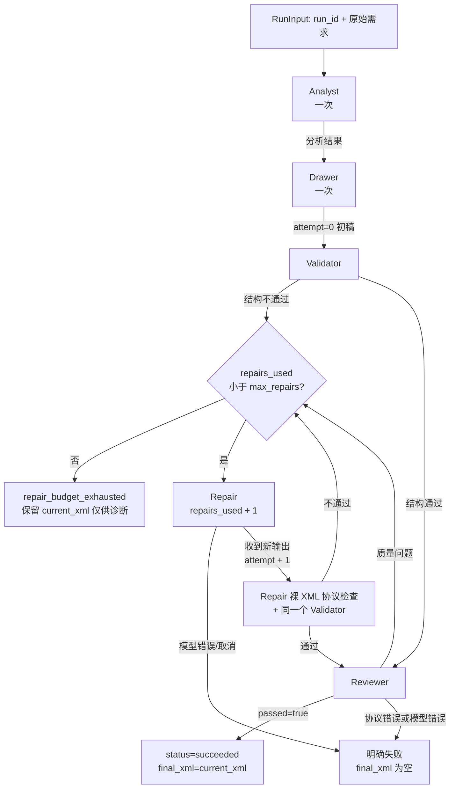
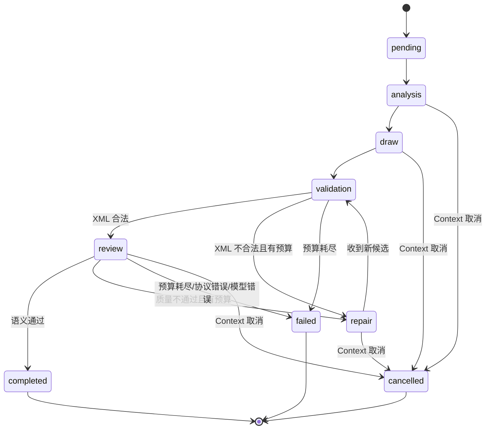

# S04：请求级状态与有限 Repair Loop

## 1. 今天解决了什么

Day 3 已经定义了两个可靠协议：

- Reviewer 只返回严格 JSON，告诉程序候选图是否满足需求；
- Repair 接收“最新候选 XML + 本轮问题”，只返回完整 XML。

但 Day 3 还没有一个程序把 Analyst、Drawer、Validator、Reviewer 和 Repair 串成闭环。原有通用 Sequential/Loop Workflow 只能按配置执行 Agent，不能表达以下业务规则：

1. XML 结构不合法时必须跳过 Reviewer；
2. Reviewer 协议错误必须立即失败，不能当成“图不好”继续修；
3. Repair 后必须检查新候选，而不是再次检查初稿；
4. 默认最多修两次，耗尽后不得再调用模型；
5. 失败候选可以保留诊断，但不能放入 `final_xml`；
6. 同一个 Controller 被并发复用时，两次请求的状态不能串用。

Day 4 新增了独立领域控制器，并用离线模型替身验证这些分支。生产 YAML、Factory、Runner 和 HTTP 入口仍未切换，留给 Day 5。

## 2. 先看懂：今天新增的代码文件分别有什么作用

这是本日最重要的文件导航：

| 新增文件 | 它具体负责什么 | 为什么需要单独存在 | 谁会调用它 |
|---|---|---|---|
| [`internal/domain/diagram/workflow/controller.go`](../../internal/domain/diagram/workflow/controller.go) | 定义一次绘图请求的状态、阶段、失败分类、四个模型角色的窄接口，以及有限 Repair Loop。它决定何时校验、何时审查、何时修复、何时成功或失败 | 通用 Agent Workflow 不理解“Validator 失败跳过 Reviewer”“协议错误不可修复”“`final_xml` 只能在全通过后赋值”等 Draw.io 业务规则；这些规则应集中在领域层，而不是塞进 HTTP Handler | Day 4 由测试直接调用；Day 5 将由生产适配器/Runner 调用 |
| [`internal/domain/diagram/workflow/controller_test.go`](../../internal/domain/diagram/workflow/controller_test.go) | 提供 Analyst、Drawer、Reviewer、Repairer 的轻量替身，模拟各种模型输出；断言候选版本、状态、错误类别和每个角色的调用次数 | Repair Loop 的关键风险在控制流，不需要真实 API 才能验证。独立测试文件让失败路径可重复、无费用、无网络依赖 | `go test` 调用；开发者修改预算或分支时先看这里的回归证据 |

本日还修改了一个已有代码文件：

| 修改文件 | 修改作用 |
|---|---|
| [`internal/domain/diagram/repair/protocol.go`](../../internal/domain/diagram/repair/protocol.go) | 保留原 `ParseResponse` 默认行为，同时新增 `ParseResponseWithValidator`，让控制器对初稿和修复稿复用同一个 Validator 实例，避免测试或未来配置出现两套校验规则 |

本学习文档和根目录计划也属于交付物，但它们不参与运行时控制流。

## 3. 最新整体流程图

下面是 **Day 4 已实现的离线领域流程**。生产装配尚未接入。



从状态角度看，同一请求只会沿以下方向移动：



## 4. 状态字段怎样理解

`State` 在每次 `Run` 内部创建，不放进共享 Controller 字段。

| 字段 | 含义 | 关键不变量 |
|---|---|---|
| `run_id` | 本次运行标识，由上层传入 | 非空；后续事件和评测用它关联同一次运行 |
| `original_requirement` | 用户原始需求 | Reviewer/Repair 始终携带，不能只依赖二手分析 |
| `analysis_result` | Analyst 的一次性输出 | 修复时复用，不重新分析 |
| `current_xml` | 当前候选，可能尚未通过 | 每收到一份 Repair 输出就替换；失败时可用于诊断 |
| `attempt` | 当前候选版本号 | 初稿为 0；收到一次 Repair 候选后加 1 |
| `repairs_used` | 已发起的 Repair 调用数 | 调用开始即加 1；Repair 调用失败时有成本但没有新候选，所以可能大于 `attempt` |
| `last_validation` | 最近一次确定性检查结果 | 当前候选结构失败时 Reviewer 不得运行 |
| `last_review` | 最近一次成功解析的 Reviewer 结果 | 协议错误不会伪造一份普通拒绝结果 |
| `stage` / `status` | 当前阶段与最终状态 | 失败类别和发生阶段分开记录 |
| `failure` | 稳定 code、stage、message 和内部 cause | 上层可用 `errors.Is/As` 判断，不必解析字符串 |
| `final_xml` | 可交付图纸 | 只有同一 `current_xml` 同时通过 Validator 和 Reviewer 才赋值 |

## 5. 改动总表

| 文件 | 类型 | 关键符号/区域 | 改动前职责 | 改动后职责 | 原因 |
|---|---|---|---|---|---|
| `internal/domain/diagram/workflow/controller.go` | 新增 | `Config`、`State`、角色接口、`Controller.Run`、失败辅助函数 | 文件不存在 | 承载 Draw.io 请求级质量闭环 | 把领域控制流从通用 Agent 框架和 HTTP 层中分离 |
| `internal/domain/diagram/workflow/controller_test.go` | 新增 | 11 组 `Test...`、函数替身、`validatorSpy` | 文件不存在 | 离线验证成功、失败、预算、协议、取消和隔离 | 让控制流证据可重复，不依赖真实模型 |
| `internal/domain/diagram/repair/protocol.go` | 修改 | `ParseResponseWithValidator` | `ParseResponse` 内部固定创建 Draw.io Validator | 默认 API 兼容，同时允许控制器注入同一 Validator | 保证初稿与修复稿采用同一规则，并便于测试观察校验顺序 |
| `docs/learning/S04-有限-Repair-Loop.md` | 新增 | 本文 | 无 Day4 独立学习资料 | 记录文件作用、数据流、流程图、逐块讲解和验证证据 | 离开聊天记录后仍能独立理解本日实现 |
| `AGENT_EVOLUTION_PLAN.md` | 修改 | 当前进度、S04 台账、Day4 交接记录 | 下一步仍指向 Day4 | 准确记录 Day4 状态、验证限制和 Day5 入口 | 让后续开发从唯一计划入口继续 |

## 6. 逐文件、逐逻辑代码块讲解

### 6.1 新增：`controller.go` 到底做什么

#### 6.1.1 常量、阶段和状态

位置：[`FailureCode`](../../internal/domain/diagram/workflow/controller.go#L49)、[`State`](../../internal/domain/diagram/workflow/controller.go#L88)。

- `DefaultMaxRepairs=2` 表示默认最多两次 Repair；`MaxSupportedRepairs=3` 是首版允许配置的上界。
- `Stage` 回答“当前执行到哪里”，例如 `validation`、`review`、`repair`。
- `Status` 回答“整次运行最后怎样结束”，例如 `succeeded`、`failed`、`cancelled`。
- `FailureCode` 回答“为什么结束”。`model_error` 与 `StageReview` 组合后，才完整表达“Reviewer 模型调用失败”。
- `State` 保存一次请求的数据。它不是 Controller 字段，所以 Controller 被复用时不会共享 `current_xml` 或轮次。

为什么 `attempt` 和 `repairs_used` 不合并：Repair 请求一旦发出，就可能已经产生延迟和费用，所以先增加 `repairs_used`；如果模型直接报错，没有收到新候选，`attempt` 不增加。这两个数的差值可以解释“花了一次调用，但没有得到新版本”。

#### 6.1.2 `Failure.Error/Unwrap`

位置：[`Failure`](../../internal/domain/diagram/workflow/controller.go#L64)。

`Error` 生成可读错误；`Unwrap` 保留底层 `context.Canceled`、`reviewer.ProtocolError` 或模型错误。上层既能记录统一业务 code，也能用 `errors.Is/As` 做可靠分类。

#### 6.1.3 四个窄接口和 `Dependencies`

位置：[`Analyst 到 Dependencies`](../../internal/domain/diagram/workflow/controller.go#L115)。

- `Analyst.Analyze`：原始需求 -> 分析结果；
- `Drawer.Draw`：原始需求 + 分析结果 -> 初稿；
- `SemanticReviewer.Review`：Reviewer Prompt -> 原始 JSON 文本；
- `Repairer.Repair`：Repair Prompt -> 原始 XML 文本；
- `Validator`：候选 XML -> 确定性结构结果。

Reviewer 接口返回原始字符串而不是直接返回 `reviewer.Result`，是为了让控制器真正执行 Day 3 的严格 Parser；否则生产适配器若偷偷宽松解析，协议错误测试会失去意义。

这些接口放在 Draw.io workflow 包中，是因为它们表达的是当前用例需要的最小能力，不是要重写全项目通用 Agent 接口。Day 5 通过适配器连接现有框架。

#### 6.1.4 `NewController`

位置：[`NewController`](../../internal/domain/diagram/workflow/controller.go#L150)。

构造函数拒绝：

- `max_repairs < 0` 或 `max_repairs > 3`；
- 任意必需角色或 Validator 缺失。

把错误配置挡在运行前，避免请求执行一半才因 nil 依赖崩溃，也避免负数预算造成含义不清。

#### 6.1.5 `Run` 的一次性阶段

位置：[`Controller.Run`](../../internal/domain/diagram/workflow/controller.go#L183)。

执行顺序：

1. 创建局部 `State`，校验 Context、`run_id` 和原始需求；
2. 调用 Analyst 一次并拒绝空分析结果；
3. 调用 Drawer 一次；空输出直接成为 `invalid_stage_output`，非空初稿放入 `current_xml`，此时 `attempt=0`；
4. 调用 `evaluateInitialCandidate`，先做确定性校验；
5. 只有 Validator 通过才构建 Reviewer Prompt。

Analyst 和 Drawer 位于修复循环外，因此无论修几次都不会重复调用。这是“Repair”区别于“从头 Retry”的核心。

#### 6.1.6 `Run` 的有限修复循环

位置：[`Controller.Run 修复循环`](../../internal/domain/diagram/workflow/controller.go#L236)。

每次进入循环都已有明确 `issues` 和 `rejectedAt`：

1. 先检查 Context，取消后不再启动新模型调用；
2. 再比较 `repairs_used` 和 `max_repairs`，耗尽立即返回；
3. `repair.BuildPrompt` 使用当前 `current_xml` 和当前问题；
4. 发起 Repair 前增加 `repairs_used`；
5. 空 Repair 输出在当前阶段直接失败；收到非空输出后才增加 `attempt` 并替换 `current_xml`；
6. `repair.ParseResponseWithValidator` 同时执行裸 XML 边界和确定性校验；
7. 坏 XML 生成 Validator 问题并直接回到预算判断，不调用 Reviewer；
8. 合法 XML 再进 Reviewer；只有 Reviewer 通过才离开循环。

成功收尾只做一件关键事：`final_xml = current_xml`。任何失败收尾都会把 `final_xml` 清空。

#### 6.1.7 候选评估和错误收尾辅助函数

位置：[`evaluateInitialCandidate`](../../internal/domain/diagram/workflow/controller.go#L313)、[`reviewCurrentCandidate`](../../internal/domain/diagram/workflow/controller.go#L328)、[`contextFailure`](../../internal/domain/diagram/workflow/controller.go#L379)、[`recordFailure`](../../internal/domain/diagram/workflow/controller.go#L407)。

- `evaluateInitialCandidate`：初稿的 Validator 门禁；失败时转换成 Repair 统一问题，成功才调用 Reviewer。
- `reviewCurrentCandidate`：构建完整审查上下文、调用 Reviewer、严格解析 JSON；质量拒绝返回问题，协议错误写入终态。
- `contextFailure`：把取消和 deadline 分开编码，并保留 Context cause。
- `recordFailure`：统一设置 `stage/status/failure` 并清空 `final_xml`，避免不同分支漏写终态。
- 两个 `...ResultPtr` 会复制 issue slice 后再存入 State，降低调用方意外修改原切片的风险。

### 6.2 新增：`controller_test.go` 到底做什么

位置：[`controller_test.go`](../../internal/domain/diagram/workflow/controller_test.go)。

文件前半部分定义四种函数型替身和 `validatorSpy`：

- 函数型替身让每个测试只写当前关心的响应，不需要实现庞大的 fake struct；
- `validatorSpy` 在调用真实 Draw.io Validator 的同时记录输入顺序，可以证明初稿、坏修复和最终修复各被检查一次；
- `decodeReviewInput/decodeRepairInput` 解析真实 Prompt payload，断言传给下一阶段的是当前版本而不是过期数据；
- `requireFailure` 统一断言返回 error 与 `state.failure` 是同一分类，并确保失败时 `final_xml` 为空。

各测试与要防止的回归：

| 测试 | 防止的回归 |
|---|---|
| [`TestRunSucceedsWithoutRepair`](../../internal/domain/diagram/workflow/controller_test.go#L148) | 首次通过却多调用 Repair；最终返回的不是 Reviewer 看过的候选 |
| [`TestRunRepairsRejectedCandidateOnce`](../../internal/domain/diagram/workflow/controller_test.go#L197) | Repair 收到旧 XML 或丢失 Reviewer 问题；修复后未重新校验 |
| [`TestRunRevalidatesBadRepairBeforeReviewingAgain`](../../internal/domain/diagram/workflow/controller_test.go#L247) | 坏 XML 被送给 Reviewer；下一轮仍修初稿而不是坏修复稿 |
| [`TestRunStopsAfterRepairBudgetIsExhausted`](../../internal/domain/diagram/workflow/controller_test.go#L302) | 超过两次 Repair；Analyst/Drawer 在循环里重复；失败候选进入 `final_xml` |
| [`TestRunHonorsZeroRepairBudgetAndSkipsReviewerForInvalidXML`](../../internal/domain/diagram/workflow/controller_test.go#L336) | 零预算被误认为默认值；结构错误仍调用 Reviewer |
| [`TestRunStopsOnReviewerProtocolError`](../../internal/domain/diagram/workflow/controller_test.go#L362) | 把坏 JSON 当质量问题并调用 Repair |
| [`TestRunClassifiesModelErrorsByStage`](../../internal/domain/diagram/workflow/controller_test.go#L385) | Analyst/Drawer/Reviewer/Repairer 错误无法定位；Repair 调用成本漏计 |
| [`TestRunRejectsEmptyStageOutputs`](../../internal/domain/diagram/workflow/controller_test.go#L456) | 模型空输出拖到下游才变成难定位的 Prompt 构建错误；空 Repair 被误算成新候选 |
| [`TestRunStopsAfterCancellation`](../../internal/domain/diagram/workflow/controller_test.go#L513) | Context 已取消仍启动 Drawer；上层无法 `errors.Is(context.Canceled)` |
| [`TestRunKeepsConcurrentRequestStateIsolated`](../../internal/domain/diagram/workflow/controller_test.go#L537) | 同一 Controller 的两个并发请求串用分析结果、XML 或 run_id |
| [`TestNewControllerRejectsInvalidConfiguration`](../../internal/domain/diagram/workflow/controller_test.go#L623) | 无效预算或缺失依赖延迟到运行时才出错 |

### 6.3 修改：`repair/protocol.go`

位置：[`ParseResponseWithValidator`](../../internal/domain/diagram/repair/protocol.go#L146)。

原 `ParseResponse(response)` 仍可直接使用，内部仍默认创建 Draw.io Validator，所以 Day 3 调用方兼容。新函数允许 Controller 注入构造时收到的 Validator：

1. 拒绝 nil Validator；
2. 先检查 Repair 输出是否为无前后文字的裸 `mxfile`；
3. 再调用注入的 Validator；
4. 不通过时仍返回结构化 `validation.Error`。

这不是把 Validator 变成模型 Agent；它仍是普通 Go 代码，只是依赖由外部明确提供。

## 7. 关键行为的 Before / After

### 7.1 控制权

Before（Day 3 结束时）：

```text
Reviewer/Repair 协议已经存在
但没有调用者根据 passed、issues 和预算做状态迁移
```

After：

```text
Controller.Run
  -> 初稿 Validator
  -> 合法才 Reviewer
  -> 质量问题才 Repair
  -> Repair 输出重新 Validator
  -> 全通过才设置 final_xml
```

不能继续保持原写法的原因：普通 Sequential Workflow 会把“最后一个 Agent 的字符串”当结果，它无法证明该字符串通过了哪个校验，也无法表达协议错误和质量拒绝的不同退出路径。

### 7.2 修复预算

Before：

```text
没有请求级 repairs_used
无法证明最多调用几次 Repair
```

After（核心伪代码）：

```go
if state.RepairsUsed >= config.MaxRepairs {
    fail("repair_budget_exhausted")
}
state.RepairsUsed++
repairedOutput := repairer.Repair(...)
```

预算检查必须在调用前；否则“最多两次”可能实际发出第三次请求。

### 7.3 Repair 输出校验

Before：

```go
func ParseResponse(response string) (string, error) {
    result := validateBareCandidate(response) // 内部固定创建 Validator
    // ...
}
```

After：

```go
func ParseResponse(response string) (string, error) {
    return ParseResponseWithValidator(response, drawio.NewValidator())
}

func ParseResponseWithValidator(
    response string,
    candidateValidator validation.Validator,
) (string, error) {
    result := validateBareCandidate(response, candidateValidator)
    // ...
}
```

兼容性：旧调用方式和默认 Draw.io 行为保持不变；只有需要统一依赖的 Controller 使用新入口。

## 8. 删除代码说明

本日无实质业务删除。

`repair.ParseResponse` 原有逻辑没有被移除，而是下沉到新函数并由旧入口委托调用。已有调用者、已有测试和默认行为不受影响。

## 9. 一次完整运行示例

### 9.1 一次修复后成功

输入：

```text
run_id = repair-once
需求 = 画出下单到扣减库存的流程
max_repairs = 2
```

真实函数顺序：

1. `Controller.Run` 创建状态：`attempt=0`、`repairs_used=0`、`status=running`。
2. Analyst 返回“订单服务调用库存服务”。
3. Drawer 返回 `initial` XML，写入 `current_xml`。
4. `evaluateInitialCandidate` 调用 Validator，结构通过。
5. `reviewCurrentCandidate` 构建包含原需求、分析和 `initial` 的 Prompt。
6. Reviewer 返回 `passed=false`，问题为 `missing_edge`。
7. 预算仍有 2 次，`repair.BuildPrompt` 收到 `initial` 和该 Reviewer 问题。
8. 发起 Repair，`repairs_used=1`；收到 `repaired` 后 `attempt=1`。
9. `ParseResponseWithValidator` 检查裸 XML 和 Draw.io 结构，通过。
10. Reviewer 再次审查的就是 `repaired`，返回 `passed=true`。
11. 状态成为 `completed/succeeded`，`final_xml` 与 `current_xml` 都是 `repaired`。

测试不仅断言最终成功，还验证 Validator 输入顺序恰好是 `[initial, repaired]`，Reviewer 两次，Repair 一次。

### 9.2 坏修复和预算耗尽

如果第一次 Repair 返回 `<mxfile><diagram/></mxfile>`：

1. `attempt=1`、`repairs_used=1`，坏候选仍写入 `current_xml` 供诊断；
2. Validator 产生 `missing_graph_model`；
3. 不调用 Reviewer；
4. 若还有预算，第二次 Repair 收到的 CurrentXML 是这份坏候选，问题来源是 `validator`；
5. 若第二次仍失败，则 `repairs_used=2`，下次预算判断直接返回 `repair_budget_exhausted`；
6. `final_xml` 保持空，最后候选仅作为诊断数据存在。

## 10. 测试与证据

### 10.1 已执行的离线验证

| 命令 | 实际结果 | 证明什么 |
|---|---|---|
| `go test -count=1 ./...`（修改前） | 全部 Go 包通过 | Day4 开始前工作区基线可用 |
| `go test -count=1 ./internal/domain/diagram/repair ./internal/domain/diagram/workflow` | 两个包通过 | Repair 兼容扩展和有限循环主要分支通过 |
| `go vet ./internal/domain/diagram/repair ./internal/domain/diagram/workflow` | 通过，无输出 | 相关包未发现 vet 静态问题 |
| `go test -count=1 -cover ./internal/domain/diagram/workflow` | 通过；语句覆盖率 85.4% | 控制器主要成功/失败分支已有测试覆盖 |
| `go test -count=1 -race ./internal/domain/diagram/workflow` | 未执行：默认 `CGO_ENABLED=0` | 不能宣称 race detector 已通过 |
| `CGO_ENABLED=1 go test -count=1 -race ./internal/domain/diagram/workflow` | 构建失败：本机 `gcc` 不在 PATH | 已确认 race 阻断来自工具链，不是测试断言失败 |
| `go test -count=1 ./...`（最终） | 全部 Go 包通过 | Day1—Day4 现有后端行为全量回归通过 |
| `go vet ./...` | 通过，无输出 | 全仓 Go 静态检查通过 |
| `gofmt -d ...`、`git diff --check`、文档链接/围栏检查 | 通过 | Go 格式、已跟踪差异空白和本学习文档结构符合约定 |

`TestRunKeepsConcurrentRequestStateIsolated` 已在普通 `go test` 中并发启动两次 Run，并通过原子计数和请求内数据断言；这提供了隔离行为证据，但不替代 race detector。

### 10.2 测试类型边界

- 模拟/离线：本日所有新增运行测试。模型响应由函数替身提供，Validator 使用真实 Go 实现。
- 真实模型：本日未调用。
- HTTP/YAML/Runner：本日未接入，也没有宣称可从现有页面触发 Repair Loop。
- Draw.io 实际加载：本日未做；测试 XML 只用于结构和控制流验证。
- 最终全量回归：已在代码、文档和计划完成后再次执行，结果见上表和计划台账。

## 11. 当前限制与排错

### 11.1 当前限制

1. Controller 还是领域层离线组件，生产 Agent 尚无适配器。
2. `run_id` 由调用方传入；Day 5/Day 7 再决定入口生成和事件关联方式。
3. Context 已贯穿 Day4 窄接口并在阶段边界检查，但现有 HTTP -> Runner -> Agent 的完整传递属于 Day 5/Day 6。
4. 没有记录耗时、token 或阶段事件；分别属于 S09 和 S06。
5. Reviewer 只能根据文本/XML 判断语义，不能替代实际渲染检查。
6. 当前机器缺 `gcc`，未取得 race detector 通过证据。

### 11.2 常见问题从哪里查

- 最终 XML 为空：先看 `state.failure.code` 和 `stage`，再看 `last_validation` / `last_review`。
- Reviewer 完全没调用：检查 `last_validation.passed`；结构失败时这是正确行为。
- Repair 没调用：检查是首次已通过、预算为 0、Reviewer 协议错误，还是模型/Context 已失败。
- 修错旧版本：在测试中解析 Repair Prompt，核对 `current_xml` 是否等于状态里的最新候选。
- 多调用一次 Repair：检查预算判断是否仍在 `RepairsUsed++` 和模型调用之前。
- `attempt` 小于 `repairs_used`：通常表示 Repair 调用失败，没有产生新候选；不是必然 bug。
- 协议错误被归成质量失败：确认真实适配器返回原始 Reviewer 字符串，让 `reviewer.ParseResponse` 统一解析。

## 12. Repair 与 Retry 的区别

| 对比 | Repair | 简单 Retry |
|---|---|---|
| 输入 | 当前候选 + 明确问题 + 原需求/分析 | 通常重复原请求 |
| 是否保留正确内容 | 明确要求尽量保留 | 可能整份重新生成 |
| Analyst/Drawer | 不重复 | 常会重新执行 |
| 预算 | 单独的 `max_repairs` | 常与网络重试或 Agent 工具循环混淆 |
| 风险 | 问题反馈错会定向修错 | 输出波动、成本和延迟增加 |
| 适用场景 | 已有候选且知道哪里不合格 | 临时网络错误、幂等操作或无候选结果 |

“多试几次”不一定更好：每次模型调用都会增加延迟和成本，Repair 也可能破坏原本正确的节点，所以必须有预算、重新校验和失败终态。

## 13. 面试表达

### 13.1 30 秒版本

我在 Go 领域层实现了一个请求级、最多两次修复的 Draw.io 质量状态机。初稿先过确定性 Validator，合法后才由 Reviewer 做语义审查；质量问题携带最新 XML 进入 Repair，修复稿必须重新校验。Reviewer 协议错误、模型错误、取消和预算耗尽都有独立分类，失败候选不会进入 `final_xml`。Controller 不保存请求状态，并用并发模型替身测试验证两次运行不会串数据。

### 13.2 2 分钟版本

原项目的 Reviewer 一次调用里既判断又修改，程序只能拿到最后字符串。Day 2、Day 3 已把 XML Validator、Reviewer JSON 和 Repair XML 协议拆开，Day 4 再把它们组装成有界控制流。我没有直接套通用 Loop Agent，因为它不能表达“结构失败跳过 Reviewer”“协议错误不可修复”和“只有同一候选通过两类检查才能交付”等业务不变量。

实现上，Controller 只保存配置和角色端口；每次 Run 建立独立 State。Analyst、Drawer 在循环外各调用一次；候选版本从 attempt 0 开始。质量失败时先检查预算，再调用 Repair。repairs_used 在调用发起时增加，attempt 只在收到非空新候选时增加，因此模型失败或空输出时能准确解释调用成本与版本数的差异。错误使用稳定 code + stage，并保留底层 cause。离线测试覆盖首次通过、修复成功、坏修复、两次耗尽、零预算、协议错误、四个模型阶段错误、空输出、取消和并发隔离；相关包覆盖率为 85.4%。目前尚未接生产 Runner，race detector 也因本机缺 gcc 未完成，这些限制会明确说明。

## 14. 术语、理解题和小练习

### 14.1 术语

- **请求级状态**：只属于一次 Run 的数据，不能存在可被其他请求改写的共享字段。
- **有限状态机**：阶段和迁移受到明确规则约束，并存在可证明的终止条件。
- **Repair budget**：允许根据质量问题调用 Repair 的最大次数，与 Agent 内工具循环或网络重试不同。
- **candidate**：当前待检查版本；它不等于可以交付的 final。
- **failure code + stage**：分别表达失败类别和发生位置，避免把所有组合做成大量重复错误码。
- **test double**：测试中替代真实模型/服务的可控实现，本日使用的是函数型 fake。

### 14.2 理解题

1. 为什么 Validator 不通过时不能继续调用 Reviewer？
2. 为什么 Reviewer 返回坏 JSON 时不能进入 Repair？
3. `repairs_used=1`、`attempt=0` 可能表示发生了什么？
4. 为什么 `current_xml` 可以保存失败候选，而 `final_xml` 不可以？
5. Controller 没有 map 或 mutex，为什么还能支持并发 Run？端口实现需要承担什么责任？

当前理解状态：待用户复述，不能因为测试通过就标记为“已掌握”。

### 14.3 可实际修改的小练习

把 `TestRunStopsAfterRepairBudgetIsExhausted` 创建 Controller 时的预算从 2 改成 1，先预测：

- Reviewer 会调用几次；
- Repair 会调用几次；
- `attempt`、`repairs_used` 和最后 `current_xml` 分别是什么。

然后同步修改断言，运行：

```powershell
go test -count=1 -run TestRunStopsAfterRepairBudgetIsExhausted ./internal/domain/diagram/workflow
```

练习完成后再恢复测试，避免改变项目默认验收口径。

## 15. 下一步

Day 5 / S05 将新增生产适配器和配置，把现有 Analyst、Drawer、新 Reviewer、新 Repair 映射到本控制器端口，并接到 Factory/Runner/同步绘图入口。成功响应仍兼容现有 `content`，但必须来自 `state.final_xml`，不能直接返回最后一个 Agent 字符串。
