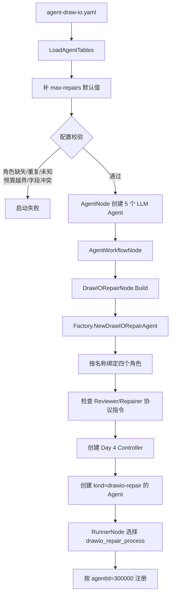
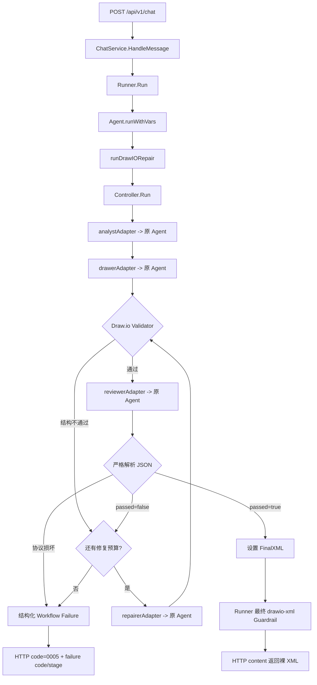

# Day 5 / S05：把 Repair Loop 接回原有配置驱动架构

> 日期：2026-09-10  
> 本日范围：YAML、Loader、Armory、Factory、Runner、同步 HTTP 入口集成。  
> 当前边界：Day 6 再完成 HTTP Context 贯穿、整次工作流超时、主动取消和真实图纸验证。

## 1. 今天解决的具体问题

Day 4 的 `Controller.Run` 已经能执行有限 Repair Loop，但调用入口只有测试代码：

```text
controller_test.go -> Controller.Run -> 四个 fake -> Validator
```

这能证明状态机正确，却不能证明用户调用原来的 `/api/v1/chat` 时会进入该状态机。如果直接在业务代码里手动 `NewController`、手动创建四个 Agent，又会绕过项目原有的 YAML、Armory、Factory 和 Runner。

Day 5 的目标是让下面这条原链路继续成立：

```text
YAML -> Loader -> Armory -> Factory -> Runner -> ChatService -> HTTP
```

区别只在于 Runner 选中的入口由通用 `sequential_draw_process` 切换为显式 `drawio_repair_process`。旧串行流程仍保留，baseline 仍能明确选择它。

## 2. 本日新增代码文件分别有什么作用

这是最需要先看懂的三个新增代码文件。

### 2.1 `drawio_repair_node.go`：Armory 装配桥梁

文件：[`internal/domain/agent/service/armory/workflow/drawio_repair_node.go`](../../internal/domain/agent/service/armory/workflow/drawio_repair_node.go)

作用：让已有 `AgentWorkflowNode` 能像创建 Sequential、Loop 一样创建 `drawio-repair`。它只把配置和已解析的子 Agent 交给 `AgentFactory.NewDrawIORepairAgent`，不保存候选 XML，也不执行循环。

为什么需要单独文件：项目原本就是“每种 Workflow 一个 Builder Node”的组织方式。新增同级 Node 比在 `AgentWorkflowNode` 中堆一段 Draw.io 业务代码更符合原工程结构。

调用关系：

```text
AgentWorkflowNode
  -> DrawIORepairNode.Build
  -> AgentFactory.NewDrawIORepairAgent
```

### 2.2 `diagram_workflow.go`：生产 Agent 与 Day 4 Controller 的适配层

文件：[`internal/infrastructure/adk/diagram_workflow.go`](../../internal/infrastructure/adk/diagram_workflow.go)

作用：这是 Day 5 最核心的新文件，完成四件事：

1. 按 YAML 中的角色名称绑定真实 `*Agent`，不靠数组下标猜职责；
2. 检查 Reviewer、Repairer 的 YAML 指令是否仍符合 Day 3 领域协议；
3. 用四个小适配器把真实 Agent 映射成 Day 4 的四个窄接口；
4. 在 `runDrawIORepair` 中调用 Controller，并且只返回 `state.FinalXML`。

它不是第二套 Agent 框架。底层模型调用仍使用原 `Agent.runWithVars`、`runLLMMessages`、ChatModel 和 ToolRouter；Controller 只决定调用顺序和停止条件。

### 2.3 `diagram_workflow_test.go`：不访问外网的完整入口证据

文件：[`internal/infrastructure/adk/diagram_workflow_test.go`](../../internal/infrastructure/adk/diagram_workflow_test.go)

作用：从真实 `agent-draw-io.yaml` 加载配置，经 Armory、Factory、Runner、ChatService 和 `/api/v1/chat` 执行。模型由按顺序返回固定响应的替身提供，所以测试稳定且不会产生真实 API 成本。

它验证的不只是 Controller：还验证 YAML 选中了新入口、Drawer 收到分析结果、Reviewer/Repairer 收到正确 JSON payload、修复稿被重新审查、成功响应仍是裸 XML，以及失败响应不会伪装成图纸。

### 2.4 本学习文档

文件：[`docs/learning/S05-配置驱动接入-Repair-Loop.md`](./S05-配置驱动接入-Repair-Loop.md)

作用：把 Day 5 的装配链、运行链、每个新增文件的职责、修改前后、测试证据和 Day 6 边界集中说明。代码能运行不等于容易理解，因此文档也是本日交付的一部分。

## 3. 最新整体流程图

### 3.1 启动装配流程



### 3.2 一次同步请求流程



这个图说明 `runSequential` 没有被删除或替换。新闭环和它同属于 `Agent.runWithVars` 的执行策略，旧工作流仍可以被配置选择。

## 4. 改动总表

| 文件 | 类型 | 关键符号/配置 | 改动前职责 | 改动后职责与原因 |
|---|---|---|---|---|
| `internal/domain/agent/model/config.go` | 修改 | `WorkflowTypeDrawIORepair`、`DrawIORepairRoles`、`MaxRepairs` | 只有 loop/parallel/sequential | 表达显式四角色和独立修复预算；指针用于区分未配置与合法的 0 |
| `internal/domain/agent/ports/ports.go` | 修改 | `NewDrawIORepairAgent` | Factory 只能创建三类 Workflow | 给原 Factory 接口增加清晰的新建入口 |
| `internal/domain/agent/service/armory/workflow/drawio_repair_node.go` | 新增 | `DrawIORepairNode` | 无对应 Builder | 复用原 Armory 多态 Builder 结构 |
| `internal/domain/agent/service/armory/workflow/agent_workflow_node.go` | 修改 | builder 注册、角色引用查询 | 只读 `sub-agents` | 新类型改读 `roles`，普通工作流保持不变 |
| `internal/app/config/loader.go` | 修改 | 默认值、`validateDrawIORepairWorkflow` | 不认识新类型，引用错误多在装配期才发现 | 启动前拒绝角色、引用、预算和字段冲突；`max-iterations` 不再误用于所有工作流 |
| `internal/app/config/loader_test.go` | 修改 | 新入口、旧基线、预算和非法配置测试 | 固定 Day 3 过渡入口 | 固定 Day 5 生产入口，同时证明旧流程仍存在 |
| `internal/infrastructure/adk/diagram_workflow.go` | 新增 | Factory、运行入口、四个适配器 | Day 4 Controller 无生产调用方 | 把 Controller 接到原 Agent 运行时，只交付 FinalXML |
| `internal/infrastructure/adk/diagram_workflow_test.go` | 新增 | 完整成功/失败集成测试 | 只有领域层 fake 测试 | 覆盖真实配置到 HTTP 的完整同步链路 |
| `internal/infrastructure/adk/adapter.go` | 修改 | `drawio-repair` 分发、`runLLMMessages` | 只有三类工作流；模型循环写在 `runLLM` 内 | 新策略进入同一分发；协议角色复用原工具循环而不复制代码 |
| `configs/agent/agent-draw-io.yaml` | 修改 | 新 Reviewer、Repairer、新 Workflow、Runner 选择 | 对外走三角色串行，Reviewer 直接修图 | 对外走有限质量闭环；旧串行流程保留作对照 |
| `cmd/baseline/main.go` | 修改 | `assembleOriginal` | 跟随生产 Runner 配置 | 强制选择旧串行入口，避免 Before 被新配置污染 |
| `pkg/types/codes.go` | 修改 | `0005` | 无闭环错误码 | 区分工作流失败与最终 XML Validator 失败 |
| `internal/trigger/http/agent_handler.go` | 修改 | `writeError` | 闭环失败会降级成 unknown error | 返回稳定的失败 code、stage、message |
| `internal/trigger/http/agent_handler_test.go` | 修改 | Workflow Failure 测试 | 只测 Validator 错误 | 固定结构化闭环错误边界 |
| `internal/domain/diagram/workflow/controller.go` | 修改 | 包与端口注释 | 注释仍称生产接入属于未来 | 注释同步为已由 ADK 适配器接入 |
| `AGENT_EVOLUTION_PLAN.md` | 修改 | 进度与交接 | Day 5 未开始 | 记录 Day 5 已完成部分和 Day 6 起点 |

## 5. 逐文件、逐逻辑代码块讲解

### 5.1 配置类型：为什么 `max-repairs` 是指针

位置：[`AgentWorkflowConfig`](../../internal/domain/agent/model/config.go#L87)、[`DrawIORepairRoles`](../../internal/domain/agent/model/config.go#L101)。

普通 `int` 无法区分：

```text
YAML 没写 max-repairs -> Go int = 0
YAML 明确写 max-repairs: 0 -> Go int = 0
```

但本项目中“没写”应采用默认值 2，“明确写 0”表示禁止自动修复。因此使用 `*int`：`nil` 才补默认值，`&0` 原样保留。

`roles` 使用字段名而不是 `sub-agents` 顺序，能直接看出哪个 Agent 是 Analyst、Drawer、Reviewer 和 Repairer，也能在 Loader 中给出精确错误。

### 5.2 Loader：启动前失败，而不是请求中途失败

位置：[`normalizeDefaults`](../../internal/app/config/loader.go#L109)、[`validateDrawIORepairWorkflow`](../../internal/app/config/loader.go#L284)。

关键顺序：

1. 只给 `loop` 补 `max-iterations=3`；
2. 只给 `drawio-repair` 补 `max-repairs=2`；
3. 建立 Agent 名称集合并拒绝重复名；
4. 检查四个角色必填、引用存在且不能复用同一个 Agent；
5. 拒绝同时配置 `sub-agents` 或 `max-iterations`；
6. 检查 Runner 最终引用确实存在。

这属于配置层，因为问题不依赖某次用户请求。若角色名拼错，服务应该启动失败，而不是先对用户调用 Analyst、Drawer 后再报错。

### 5.3 Armory：沿用原 Builder 扩展点

位置：[`AgentWorkflowNode`](../../internal/domain/agent/service/armory/workflow/agent_workflow_node.go#L22)、[`DrawIORepairNode`](../../internal/domain/agent/service/armory/workflow/drawio_repair_node.go#L12)。

`AgentWorkflowNode` 仍负责遍历 YAML 工作流。普通类型查询 `sub-agents`；新类型调用 `Roles.AgentNames()` 得到四个名称，再从同一个 `DynamicContext` 查询已经创建的 Agent。

`DrawIORepairNode.Build` 只有一次 Factory 委托。请求级 `State` 不能放在这里，因为 Armory 是启动装配链，不是每次请求执行链。

### 5.4 Factory：角色绑定和协议漂移检查

位置：[`NewDrawIORepairAgent`](../../internal/infrastructure/adk/diagram_workflow.go#L20)、[`resolveDrawIORoleAgents`](../../internal/infrastructure/adk/diagram_workflow.go#L104)。

Factory 做第二层防御：即使某个测试或未来调用者绕过 Loader 直接调用 Factory，也必须满足以下条件：

- 类型确实是 `drawio-repair`；
- 四个名称都有对应的 `*Agent`；
- 每个角色都是 LLM Agent；
- 同一个 Agent 不能兼任两个角色；
- Reviewer/Repairer 指令与 Day 3 协议一致；
- `max-repairs` 能被 Controller 接受；
- `drawio-xml` Validator 已注册。

协议指令既保存在 YAML，运行时又和 Go 常量比较，是为了防止有人把新 Reviewer 改回“发现问题后直接输出 XML”，导致 Controller 把 XML 当 JSON 解析。

### 5.5 四个适配器：不是四套 Agent

位置：[`analystAgentAdapter`](../../internal/infrastructure/adk/diagram_workflow.go#L162) 到 [`repairerAgentAdapter`](../../internal/infrastructure/adk/diagram_workflow.go#L185)。

- Analyst：把原始需求作为用户消息调用原 Agent；
- Drawer：把分析结果放进原来的 `analysis_result` 变量作用域，再调用原 Agent；
- Reviewer：把 Controller 构建的 JSON payload 作为用户消息，系统消息仍是严格 Reviewer 指令；
- Repairer：把最新 XML 和本轮 issues 的 JSON payload 交给原 Repair Agent。

每个适配器只转换输入形状，真正的模型和工具循环仍在 `Agent` 中，因此没有手写第二套模型客户端、工具路由或重试机制。

### 5.6 `runWithVars` 和 `runDrawIORepair`

位置：[`runWithVars`](../../internal/infrastructure/adk/adapter.go#L176)、[`runDrawIORepair`](../../internal/infrastructure/adk/diagram_workflow.go#L78)。

`runWithVars` 新增一个同级分支：

```go
case "sequential":
    return a.runSequential(...)
case "drawio-repair":
    return a.runDrawIORepair(...)
```

通用 `runSequential` 没有加入任何 Draw.io 判断。`runDrawIORepair` 为请求生成进程内运行 ID，调用 Controller；失败直接返回领域错误，成功还要确认 `FinalXML` 非空，然后将它交回 Runner。

`runLLMMessages` 是从原 `runLLM` 提取出的共用代码，模型工具调用上限仍为 4，普通 Agent 行为不变。提取的原因是协议角色也应复用原模型循环，不能复制一套工具处理代码。

### 5.7 YAML：生产入口切换但基线不删除

位置：[`agent_semantic_reviewer`](../../configs/agent/agent-draw-io.yaml#L78)、[`agent_repairer`](../../configs/agent/agent-draw-io.yaml#L90)、[`drawio_repair_process`](../../configs/agent/agent-draw-io.yaml#L119)、[`runner.agent-name`](../../configs/agent/agent-draw-io.yaml#L138)。

新工作流配置：

```yaml
- type: drawio-repair
  name: drawio_repair_process
  max-repairs: 2
  roles:
    analyst: agent_analyst
    drawer: agent_drawer
    reviewer: agent_semantic_reviewer
    repairer: agent_repairer
```

旧 `agent_reviewer` 和 `sequential_draw_process` 都保留。生产 Runner 选择新流程；`cmd/baseline` 在内存副本中强制把 Runner 改回旧流程，保证 Before 数据仍然是三次模型调用的原口径。

### 5.8 HTTP 错误边界

位置：[`CodeDiagramWorkflowFailed`](../../pkg/types/codes.go#L14)、[`writeError`](../../internal/trigger/http/agent_handler.go#L157)。

成功响应没有改：

```json
{"code":"0000","data":{"content":"<mxfile>...</mxfile>"}}
```

预算耗尽等闭环失败现在返回：

```json
{
  "code": "0005",
  "info": "repair_budget_exhausted at validation: ...",
  "data": {
    "code": "repair_budget_exhausted",
    "stage": "validation",
    "message": "..."
  }
}
```

HTTP 状态仍按项目现有约定为 200，业务成功与失败由 Envelope `code` 区分。本日没有顺带改变整个 API 的状态码策略。

## 6. 关键行为 Before / After

### 6.1 生产执行入口

Before：

```text
Runner -> sequential_draw_process
       -> Analyst -> Drawer -> 旧 Reviewer
       -> 最后一个字符串
```

After：

```text
Runner -> drawio_repair_process
       -> Day 4 Controller
       -> Validator / 只读 Reviewer / 有限 Repair
       -> state.FinalXML
```

不能继续返回“任意最后一个字符串”，因为 Reviewer JSON、坏 Repair XML 或预算耗尽时的最后候选都不是可交付图纸。

### 6.2 角色配置

Before：

```yaml
sub-agents: [analyst, drawer, reviewer]
```

After：

```yaml
roles:
  analyst: ...
  drawer: ...
  reviewer: ...
  repairer: ...
```

数组适合无条件串行，但 Repair Loop 存在回跳和条件分支，显式角色更容易校验和讲解。

### 6.3 错误配置暴露时间

Before：未知子 Agent 可能被 `QueryAgentList` 静默漏掉，随后在装配或请求阶段才出现间接错误。  
After：Loader 直接指出哪个 `roles.*` 缺失、重复、未知，或预算/字段冲突。

## 7. 删除代码说明

本日无实质业务删除。

- `runSequential` 保留且行为不变；
- 旧 XML Reviewer 和旧串行工作流保留；
- Day 4 Controller 保留并成为生产运行时的领域核心；
- 原 `runLLM` 的模型循环不是删除，而是原样下沉到 `runLLMMessages`，由普通 Agent 和协议角色共同复用。

## 8. 一次完整运行示例

输入：“画出下单到扣减库存的流程”。

测试中的真实函数顺序和模型调用次数：

1. `/api/v1/chat` 调用 `ChatService.HandleMessage`；
2. Runner 选中 `drawio_repair_process`；
3. Analyst 返回分析结果，模型调用数 1；
4. Drawer 的 system instruction 已注入分析结果，返回初稿，模型调用数 2；
5. Validator 检查初稿通过；
6. Reviewer 收到原需求、分析和初稿，返回 `passed=false`，模型调用数 3；
7. Repairer 收到初稿和 `source=reviewer` 的问题，返回修复稿，模型调用数 4；
8. Validator 重新检查修复稿通过；
9. Reviewer 审查修复稿并返回 `passed=true`，模型调用数 5；
10. Controller 设置 `FinalXML`；Runner 再做最终 Guardrail；HTTP `content` 等于修复稿。

本机离线集成测试记录：`model_calls=5`，该次测试入口耗时约 `528.8µs`。这是本地固定响应的控制流证据，不是实际模型延迟或性能基准。

失败示例：初稿和两次 Repair 都返回缺少 `mxGraphModel` 的 XML。

```text
Analyst 1 + Drawer 1 + Repair 2 = 4 次模型调用
Reviewer 0 次
```

第二次坏修复后预算耗尽，HTTP 返回 `0005`、`repair_budget_exhausted`、`validation`，响应中没有成功 `content`。

## 9. 测试与证据

### 9.1 已执行

| 命令 | 结果 | 证明内容 |
|---|---|---|
| `go test -count=1 -v ./internal/infrastructure/adk ./internal/trigger/http ./internal/app/config ./cmd/baseline` | 全部通过 | 配置入口、完整同步成功/失败链路、错误映射、原 runSequential/工具循环和 baseline 均未回归 |
| `go vet ./internal/app/config ./internal/domain/agent/service/armory/workflow ./internal/infrastructure/adk ./internal/trigger/http ./cmd/baseline` | 通过，无输出 | Day 5 相关包未发现 vet 静态问题 |
| `go test -count=1 ./...` | 全部通过 | Day 1—Day 5 所有 Go 包全量回归通过 |
| `go vet ./...` | 通过，无输出 | 全仓 Go 静态检查通过 |
| `git diff --check` | 通过；仅提示 Windows 行尾将转换 | 当前已跟踪差异无空白错误 |

关键测试映射：

| 测试 | 防止的回归 |
|---|---|
| `TestDrawioConfigSelectsRepairWorkflowAtPublicBoundary` | YAML 看似新增闭环，但 Runner 仍选旧入口 |
| `TestDrawioConfigKeepsLegacySequentialWorkflowForBaseline` | 为切生产入口误删旧 A/B 对照流程 |
| `TestValidateDrawIORepairWorkflowRejectsInvalidConfiguration` | 角色、引用、预算错误拖到真实请求才失败 |
| `TestDrawIORepairWorkflowRunsThroughConfiguredHTTPEntry` | Controller 只存在于单元测试，未真正进入原同步链路 |
| `TestDrawIORepairWorkflowFailureDoesNotMasqueradeAsDiagram` | 坏 Repair 或预算耗尽仍被当作成功 XML |
| `TestNewDrawIORepairAgentRejectsProtocolInstructionDrift` | Reviewer 配置退回直接修图协议却仍能启动 |
| `TestWriteErrorPreservesDiagramWorkflowFailure` | code/stage 在 HTTP 边界丢失 |
| `TestOriginalPipelineRecordsUnmodifiedStageInputs` | baseline 跟随生产配置而污染原始三阶段口径 |

### 9.2 证据边界

- 已验证：离线固定模型响应、真实 YAML 解析、真实 Factory/Runner/HTTP 代码路径。
- 未验证：真实外部模型、真实 MCP、浏览器 Draw.io 加载、真实耗时和 token usage。
- 最小调用次数和本地入口耗时只记录在集成测试日志；正式指标事件与持久化属于 S09。

## 10. 当前限制与 Day 6 起点

1. `Runner.Run`、插件和流式入口仍创建 `context.Background()`，HTTP 断开还不能取消在途模型调用；Day 6 必须把请求 Context 贯穿到底层。
2. 当前只有模型客户端自己的单次请求 timeout，还没有“整个 Analyst + Drawer + 多轮 Repair”的总超时。
3. `run_id` 当前是进程内 `workflow-name:counter`，还没有和未来 SSE 事件、用户/session 信息关联。
4. 新流程已能经同步入口运行，但本日没有消耗真实 API 额度，也没有把真实 XML 加载到 Draw.io。
5. Reviewer/Repairer 仍共享 ChatModel 可见的工具列表；是否限制特定角色工具属于后续安全细化，不在 Day 5 扩范围。

## 11. 常见排错顺序

- 服务启动时报 `roles.reviewer references unknown agent`：先查 YAML 名称是否和 `agents[].name` 完全一致。
- 报 `instruction does not match the required protocol`：对照 Day 3 的 `reviewer.Instruction` 或 `repair.Instruction`，不要让 Reviewer 直接输出 XML。
- Drawer 没看到分析：检查 Drawer instruction 是否仍使用 `{analysis_result}`，再看 `drawerAgentAdapter` 的变量名。
- Reviewer 完全未调用：先看 XML 是否通过 Validator；结构失败跳过 Reviewer 是设计行为。
- 返回 `0005`：读取 `data.code` 和 `data.stage`；预算耗尽不是 HTTP 传输失败。
- baseline 出现 5 次模型调用：检查 `assembleOriginal` 是否仍强制选择 `sequential_draw_process`。

## 12. 面试表达

### 30 秒

Day 4 我先在领域层用测试替身验证有限 Repair Loop，Day 5 再通过适配器把它接回原有 YAML、Armory、Factory 和 Runner。新增的 `drawio-repair` 配置显式绑定四个角色和修复预算，Loader 在启动期拒绝缺失、重复和未知引用。运行时四个小适配器仍调用原 Agent 和工具循环，Controller 只负责状态迁移，Runner 只返回通过两类检查的 `FinalXML`。旧 Sequential 流程保留用于基线对照。

### 2 分钟要点

原 `runSequential` 的抽象是每个子 Agent 执行一次，它不适合表达“结构失败跳过 Reviewer、Repair 后回到 Validator、预算耗尽退出”。我没有把 Draw.io 业务硬编码进通用函数，而是在同一个 `runWithVars` 分发中增加一个配置驱动策略。Loader 负责静态配置错误，Factory 负责运行时类型和协议一致性，Controller 负责请求级状态，HTTP 只负责传输和错误映射。集成测试从真实 YAML 一直走到 `/api/v1/chat`，一次修复成功是五次模型调用；连续坏修复是四次并返回结构化失败。当前 Context 仍未从 HTTP 贯穿，这是 Day 6 明确的剩余项。

## 13. 术语

- **Adapter（适配器）**：把已有 `*Agent` 的调用方式转换成 Controller 需要的窄接口，不改变模型本身。
- **Composition Root（装配根）**：项目启动时把配置、Factory、Runner 等对象连接起来的位置，本项目由 Armory/Bootstrap 承担。
- **Fail Fast**：角色或预算配置错误时启动即失败，不等用户请求执行一半才报错。
- **Protocol Drift（协议漂移）**：YAML 提示词与代码依赖的数据契约逐渐不一致。
- **Defense in Depth（纵深防御）**：Controller 已验证 FinalXML，Runner 仍保留最终 Guardrail；Loader 校验后 Factory 仍做第二层检查。

## 14. 理解题与小练习

理解题：

1. 为什么 `max-repairs` 必须使用 `*int`，普通 `int` 会混淆哪两种配置？
2. 为什么四个角色按名称绑定，而不是约定 `sub-agents[2]` 永远是 Reviewer？
3. 为什么 Day 5 不直接修改 `runSequential` 的循环？
4. 为什么 Controller 已验证 XML 后，Runner 还保留最终 `drawio-xml` Guardrail？
5. 一次修复成功为什么是 5 次模型调用，而不是 4 次？

小练习：把 YAML 的 `max-repairs: 2` 临时改成 `max-repairs: 0`，先预测初稿被 Reviewer 拒绝后会返回什么 code、Repair 调用几次；然后运行相关配置和 Controller 测试。练习结束后恢复为 2，避免改变生产默认演示路径。

当前理解状态：待用户复述。

## 15. 下一步

Day 6 继续完成 S05：修改 Runner/Service/HTTP 接口，使 `c.Request.Context()` 贯穿插件、Workflow、四个角色、ChatModel 和 ToolRouter；增加整次工作流 timeout，验证断开或超时后不再启动下一轮 Repair；最后在真实模型可用时生成并加载至少一份 Draw.io XML。
